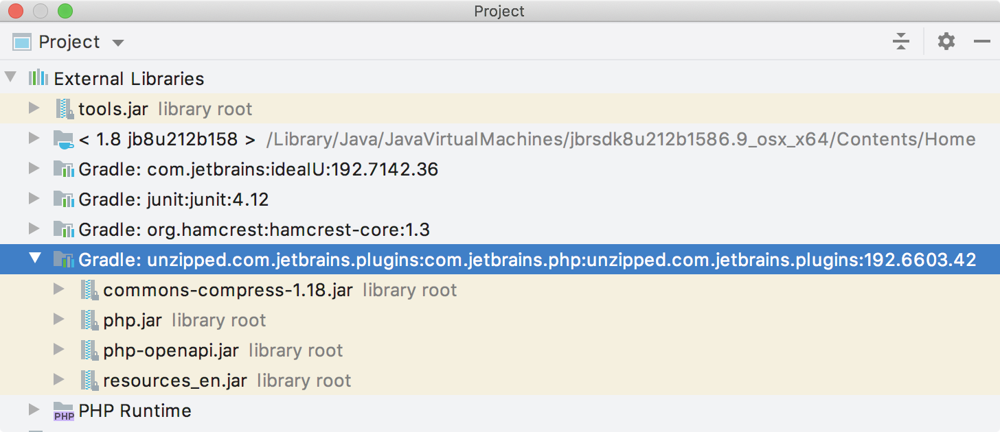

<!-- Copyright 2000-2025 JetBrains s.r.o. and other contributors. Use of this source code is governed by the Apache 2.0 license that can be found in the LICENSE file. -->

## Introduction
All products based on the _Consulo_ are built on the same underlying API.
Some of these products share features built on top of the platform, such as Java support.
Underlying those shared features are shared components.
When authoring a plugin for the Consulo, it is important to understand and declare dependencies on these components.
Otherwise, it may not be possible to load or run the plugin in a product because the components on which it depends aren't available.

* bullet list
{:toc}

## Declaring Plugin Dependencies
For the purposes of dependencies, a _module_ can be thought of like a built-in plugin that ships as a non-removable part of a product.
A working definition of a dependency is that a plugin project cannot be run without the module present in an Consulo-based product.
Declaring a dependency on a module also expresses a plugin's compatibility with a product in that the Consulo determines whether a product contains the correct modules to support a plugin before loading it.

[Part I](/basics/plugin_structure/plugin_dependencies.md) of this document describes the syntax for declaring plugin dependencies and optional plugin dependencies.
Part II of this document (below) describes the Consulo modules' functionality to aid in determining the dependencies of a plugin.

The way dependency declarations are handled by the Consulo is determined by the contents of the `plugin.xml` file:
* If a plugin does not declare any dependencies in its `plugin.xml` file, or if it declares dependencies only on other plugins but not modules, it's assumed to be a legacy plugin and is loaded only in Consulo.
  This configuration of the dependency declaration is deprecated; do not use it for new plugin projects.
* If a plugin declares at least _one_ module dependency in its `plugin.xml` file, the plugin is loaded if an Consulo-based product contains _all the modules and plugins_ on which the plugin has declared a dependency.

## Modules
A _module_ represents a built-in plugin that is a non-removable part of a product.
Some modules are available in all products, and some modules are available only in some, or even just one product.
This section identifies and discusses modules of both types.

### Declaring Incompatibility with Module
Starting in 2020.2, a plugin can declare incompatibility with an arbitrary module by specifying `<incompatible-with>` containing module ID in its `plugin.xml`.

### Modules Available in All Products
A core set of modules are available in all products based on the Consulo.
These modules provide a set of shared functionality.
The following table lists modules that are currently available in all products.

> **NOTE** All plugins should declare a dependency on **`consulo.modules.platform`** to indicate dependence on shared functionality.

| Module for `<depends>` Element Declaration in `plugin.xml` File |  Functionality                                                                                                |
| ------------------------------------------------------------------ | ---------------------------------------------------------------------------------------------------------------- |
| **`consulo.modules.platform`**                                     | Messaging, UI Themes, UI Components, Files, Documents, Actions, Components, Services, Extensions, Editors        |
| `consulo.modules.lang`                                             | File Type, Lexer, Parser, Highlighting, References, Code Completion, Find, Rename, Formatter, Code Navigation    |
| `consulo.modules.xml`                                              | XML, XML DOM, XSD/DTD, DOM Model                                                                                 |
| `consulo.modules.vcs`                                              | VCS Revision Numbers, File Status, Change Lists, File History, Annotations                                       |
| `consulo.modules.xdebugger`                                        | Debug Session, Stack Frames, Break Points, Source Positions, Memory Views, Tracked Instances                     |

As of this writing, if a plugin: **A)** is dependent _only_ on one or more of the modules in the table above, **and B)** declares those module dependencies in `plugin.xml`, then any product based on the Consulo will load it.

### Modules Specific to Functionality
More specialized functionality is also delivered via modules and plugins in Consulo-based products.
For example, the `consulo.modules.python` module supports the Python language-specific functionality.
If a plugin uses this module's functionality, such as Python-specific inspections and refactoring, it must declare a dependency on this module.

Note that not all products define and declare modules.

The following table lists **(1)** modules or built-in plugins that provide specific functionality, and the products currently shipping with them.

| Module or Plugin for `<depends>` Element Declaration in `plugin.xml` File |  Functionality                                                                                                                                  | Consulo-Based Product Compatibility                                                                                                                           |
| ---------------------------------------------------------------------------- | -------------------------------------------------------------------------------------------------------------------------------------------------- | -------------------------------------------------------------------------------------------------------------------------------------------------------------------------- |
| `consulo.modules.java` See **(2)** below.  `consulo.java`                     | **Java** language PSI Model, Inspections, Intentions, Completion, Refactoring, Test Framework                                                      | Consulo with Java plugin                                                                                                                                                   |
| `consulo.modules.python`                                                     | **Python** language PSI Model, Inspections, Intentions, Completion, Refactoring, Test Framework                                                    | Consulo with Python plugin installed.                                                                                                                                      |

**Notes about Module and Plugin Dependency:**

**(1)** This table is not exhaustive; other modules are currently available in Consulo-based IDEs.
To see a list of modules, invoke the code completion feature for the `<depends>` element contents while editing the `plugin.xml` file.

**(2)** The Java language functionality was extracted as a plugin in the Consulo.
This refactoring separated the Java implementation from the other, non-language portions of the platform.
Consequently, [dependencies](/basics/plugin_structure/plugin_dependencies.md) on Java functionality are expressed differently in `plugin.xml` depending on the version of the Consulo being targeted:

* `plugin.xml` add `<depends>consulo.java</depends>` or `<depends>consulo.modules.java</depends>`

## Exploring Module and Plugin APIs
Once the [dependency on a module or plugin](/basics/plugin_structure/plugin_dependencies.md) is declared in `plugin.xml`, it's useful to explore the packages and classes available in that dependency.
The section below gives some recommended procedures for discovering what's available in a module or plugin on which a project depends.
These procedures assume a project has the `pom.xml` and `plugin.xml` dependencies configured correctly.

### Exploring APIs as a Consumer
Exploring the available packages and classes in a plugin or module utilizes features in the Consulo IDE.

If the project is not up to date, reimport the Maven project as a first step.
Reimporting the project will automatically update the dependencies.

In the Project Window, select Project View and scroll to the bottom to see External Libraries.
Look for the library matching, or similar to the contents of the `<depends>` tags in `plugin.xml`.
The image below shows the External Libraries for the example plugin project configuration explained in [Configuring pom.xml](/products/dev_alternate_products.md#configuring-pomxml) and [Configuring plugin.xml](/products/dev_alternate_products.md#configuring-pluginxml).

{:width="700px"}

Expand the External Library (as shown) to reveal the JAR files contained in the library.
Drill down into the JAR files to expose the packages and (decompiled) classes.

### Exploring APIs as an Extender
If a project is dependent on a plugin or module, in some cases, the project can also [extend](/basics/plugin_structure/plugin_extensions.md) the functionality available from the plugin or module.

To browse the opportunities for extension, start by placing the cursor on the contents of the `<depends>` elements in the project's `plugin.xml` file.
Use the Go to Declaration IDE feature to navigate to the `plugin.xml` file for the plugin on which the project depends.

A common, but not universal, pattern in the Consulo is for a plugin to declare `<extensionPoints>` and then implement each one as `<extensions>`.
Search the dependent plugin's `plugin.xml` file for:
* `<extensionPoints>` to find the opportunities for extending the plugin's functionality.
* `<extensions>` to find where the plugin extends functionality.
  The extension namespace will match the `<id>` defined in the `plugin.xml` file.

## Verifying Dependency
Before marking a plugin project as _dependent only on modules in a target product_ in addition to `consulo.modules.platform`, verify the plugin isn't implicitly dependent on any APIs that are specific to a particular product.

For [Maven-based](/tutorials/build_system.md) projects, [Plugin Verifier](/reference_guide/api_changes_list.md#plugin-verifier) can be used to ensure compatibility with all specified target IDEs.

For DevKit-based projects, create an SDK pointing to an installation of the intended target Consulo-based product.
Use the same development version of the Consulo as the targeted product.

Based on the tables above, the [Consulo Plugin Repository](https://plugins.consulo.app) automatically detects the products with which a plugin is compatible, and makes the compatibility information available to plugin authors.
The compatibility information determines if plugins are available at the plugin repository to users of a particular Consulo-based product.

## Platform API Version Compatibility
The API of _Consulo_ and bundled plugins may change between releases.
The significant changes that may break plugins are listed on [Incompatible Changes in Consulo and Plugins API](/reference_guide/api_changes_list.md) page.
