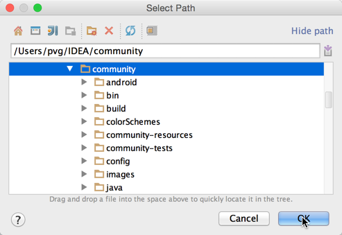
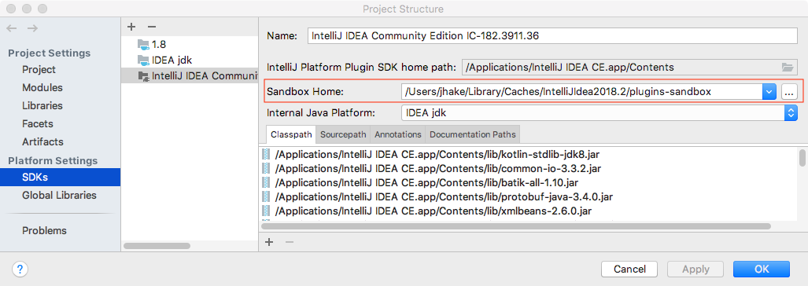

<!-- Copyright 2000-2020 JetBrains s.r.o. and other contributors. Use of this source code is governed by the Apache 2.0 license that can be found in the LICENSE file. -->

> **NOTE** For new projects, it is highly recommended to use [Gradle](/tutorials/build_system.md).

### Preliminary Steps

Use the following checklist to ensure that you are ready to develop your custom plugins.

- **Get IntelliJ IDEA CE source code** on your local computer.
  Getting IntelliJ IDEA CE source code is not a requirement for plugin development, but having it makes debugging your plugins much more straightforward.
  For detailed instructions, refer to the _Getting IntelliJ IDEA Community Edition Source Code_ section of [Check Out And Build Community Edition](upsource:///README.md).
  Note that building IntelliJ IDEA CE from source code is not required for plugin development.
- **Plugin DevKit** plugin must be [enabled in IntelliJ IDEA](https://www.jetbrains.com/help/idea/managing-plugins.html).
- **IntelliJ Platform SDK** must be configured for your IDEA project.
  For more information, see below.

### Configuring IntelliJ Platform SDK

To set up your plugin development environment:

* Create a new *IntelliJ Platform SDK* under **File \| Project Structure**:
  
   
   
* Specify the installation folder of the *IntelliJ IDEA Community Edition* as the home directory.
  > **WARNING** You may use IntelliJ IDEA Ultimate as an alternative, but debugging the core code will only work with the *Community Edition*.
  
   
   
* Select **1.8** as the default Java SDK.
  See the _IntelliJ Build Configuration_ section of [Check Out And Build Community Edition](upsource:///README.md) for instructions about creating **1.8** Java SDK.
  
   
   
* In the Sourcepath tab of the SDK settings, click the *Add* button:
  
   
   
* Specify the source code directory for the *IntelliJ IDEA Community Edition*:
  
   
   
* Specify the **Sandbox Home** directory.
  The *Sandbox Home* directory stores the settings of the IDE development instance launched from a Plugin Project's **Run** configuration.
  Shown below is the default *Sandbox Home* directory for a user on Mac OS X.
  Any directory can be chosen as the *Sandbox Home* location.
  Use the ellipsis button (shown below) to define a custom location.

  See the [IDE Development Instances](/basics/ide_development_instance.md) page for more information about default *Sandbox Home* directory locations and contents.
  
  
