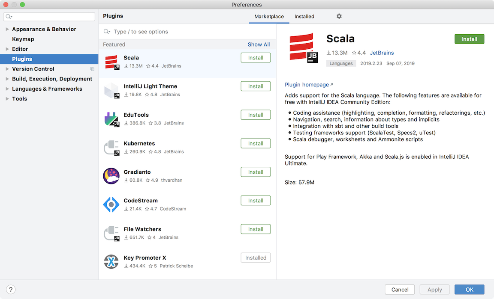
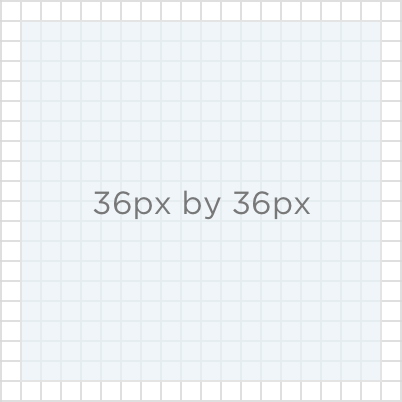
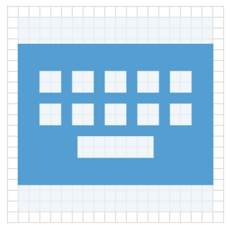
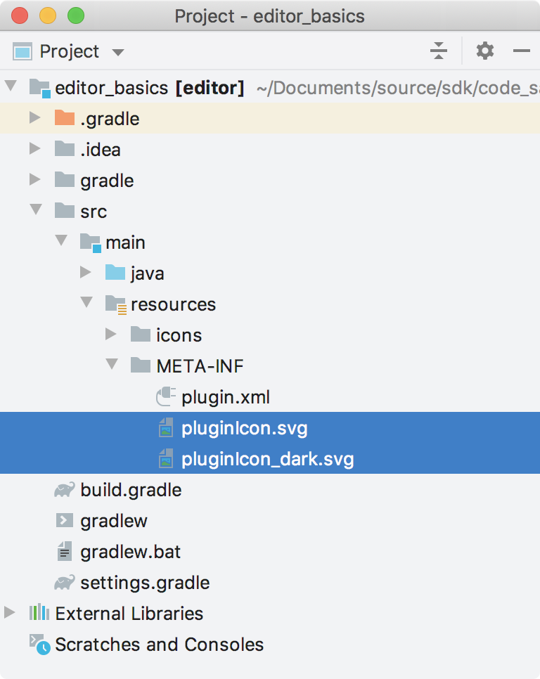

<!-- Copyright 2000-2025 JetBrains s.r.o. and other contributors. Use of this source code is governed by the Apache 2.0 license that can be found in the LICENSE file. -->

Beginning in version 2019.1, the Consulo supports representing a plugin with a logo.
A _Plugin Logo_ is intended to be a unique representation of a plugin's functionality, technology, or company.
Previously this page referred to Plugin Logos as _Plugin Icons_.

**Note:** icons and images used within a plugin have different requirements.
See [Working with Icons and Images](/reference_guide/work_with_icons_and_images.md) for more information.

## Introduction
Plugin Logos are shown in the [Consulo Plugin Repository](https://plugins.consulo.app).
They also appear in the Settings/Preferences Plugin Manager UI in Consulo.
Whether online or in the product UI, a Plugin Logo helps users to identify a plugin more quickly in a list, as shown below:

                                
::: info
Plugin logos are displayed in the "Plugins" settings dialog for installed plugins.
:::

## Plugin Logo Requirements
For a Plugin Logo to be displayed correctly within Consulo, it must:
* Follow the best practices design guidelines,
* Be in the correct file format,
* Conform to file name conventions,
* Be in the `META-INF` folder of the plugin distribution file.

### Plugin Logo Size
The Plugin Logo should be provided in one size: 40px by 40px.

A Plugin Logo is displayed in two sizes, and scales automatically in each context:
* 40px by 40px in the plugins list in the Plugin Manager UI.
* 80px by 80px in the plugin details screen in the Plugin Manager UI and on the plugin's page in the Plugin Repository.

Verify that Plugin Logo designs are effective in both sizes and all display contexts.

### Plugin Logo Shape
Plugin Logo designs should leave at least 2px transparent padding around the perimeter, as shown below:

Make sure Plugin Logos have the same visual weight as the logos in the examples below.
The more filled a Plugin Logo design is, the less actual space it needs.
See more examples of visual weight compensation in the Consulo UI Guidelines for Icons.

For basic shapes, use the following sizes.
Note the different areas of transparent padding used for each shape:

|  |  |
|:---:|:---:|
| _Square logo 32px by 32px_ | _Circular logo 36px in diameter_ |
|  |  |
| _Horizontal rectangular logo 36px by 26px_ | _Vertical rectangular logo 26px by 36px_ |

 

### Plugin Logo Colors
If the plugin's technology already has a logo, use its colors.
Check the license terms before using the logo.
If there is no existing logo, or its use is prohibited, create a custom logo based on the Consulo UI Guidelines for Icons.

|  |  |
|:---:|:---:|
| _The YouTrack Plugin Logo uses the YouTrack product logo_ | _The Keymap Plugin Logo uses a color from the Action Colors Palette_ |

Ensure a Plugin Logo is visible on both light and dark backgrounds.
If one Plugin Logo design does not work on both light and dark backgrounds, create separate light and dark versions of the Plugin Logo.
The examples below illustrate how a Plugin Logo design may work well for a light background but not for a dark background.
Consequently, a separate Plugin Logo for dark backgrounds is needed.

|  |  |  |
|:---:|:---:|:---:|
| _The light Plugin Logo design works well on light UI Theme_ | _The light Plugin Logo design does not work well on a dark UI Theme_ | _A separate, dark Plugin Logo design works well on dark UI Theme_ |

### Plugin Logo File Format
All Plugin Logo images must be SVG format.
This vector image format is required because the Plugin Logo file must be small, and the image must scale without any loss of quality.

### Plugin Logo File Naming Convention
Name the Plugin Logo files according to the following conventions:
* `pluginIcon.svg` is the default Plugin Logo.
  If a separate Logo file for dark UI Themes exists in the plugin, then this file is used solely for light UI Themes,
* `pluginIcon_dark.svg` is an optional, alternative Plugin Logo for use solely with dark IDE UI Themes.

## Adding Plugin Logo Files to a Plugin Project
The Plugin Logo files must be in the `META-INF` folder of the plugin distribution file, i.e., the `*.jar` or `*.zip` file you upload to the plugin repository and install into Consulo.

To include Plugin Logo files in your distribution file, place the Plugin Logo files into a plugin project's `resources/META-INF` folder.
Note that this requirement is the same regardless of using DevKit or Maven for developing a plugin.
For example:

