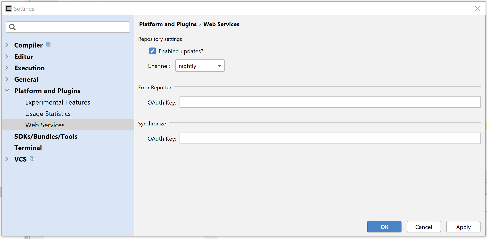

# Update Channels

Consulo has four public update channels, and one internal (in parentheses iteration information):

 * **release** (every monday new builds come at 00:00)
 * **beta** (every day new builds come at 00:00)
 * **alpha** (by hand on my own will (@VISTALL))
 * **nightly** (after each commit to platform or plugin)

## Channel settings

You can always change channel in settings

And then click **About -> Check for updates**

# WARNING

In **nightly** / **alpha** channel sometimes plugins don't have builds for new platform (for example compilation failed)

**Keep calm - Consulo do not allow update, if some plugins missed, you will get warning about it.**
