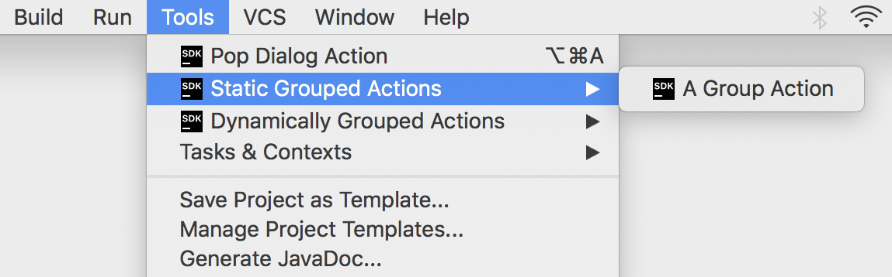
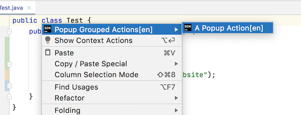
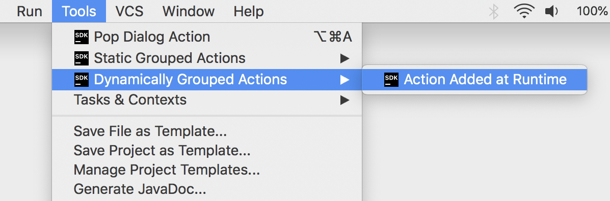

<!-- Copyright 2000-2025 JetBrains s.r.o. and other contributors. Use of this source code is governed by the Apache 2.0 license that can be found in the LICENSE file. -->

If an implementation requires several actions, or there are simply too many actions that overload the menu, the actions can be placed into groups.
This tutorial demonstrates adding an action to an existing group, creating a new action group, and action groups with a variable number of actions.
The sample code discussed in this tutorial is from the `action_basics` code sample. See the Consulo plugin template for examples.

Some content in this tutorial assumes the reader is familiar with the tutorial for [Creating Actions](working_with_custom_actions.md).

* bullet list
{:toc}

## Simple Action Groups
In this first example, the action group will be available as a top-level menu item, and actions are represented as drop-down menu items.
The group is based on a default Consulo implementation.

### Creating Simple Groups
Groups can be registered by annotating a class with `@ActionImpl` or by using `@ActionImpl` on a `DefaultActionGroup` subclass.
For simple static groups, the Consulo framework's default `DefaultActionGroup` implementation can be used directly.
The `id` parameter must be unique, so incorporating the plugin ID or package name is the best practice.

The group's popup behavior, icon, and compact settings are configured through the group class or its `Presentation`.
See [Registering Actions with @ActionImpl](/basics/action_system.md#registering-actions-with-actionimpl) for more information about these attributes.

```java
@ActionImpl(id = "org.consulo.sdk.action.GroupedActions")
public class GroupedActions extends DefaultActionGroup {
    public GroupedActions() {
        super("Static Grouped Actions", true);
        getTemplatePresentation().setIcon(SdkIcons.Sdk_default_icon);
    }
}
```

### Binding Action Groups to UI Components
The following sample shows how to use the `parents` parameter in `@ActionImpl` to place a custom action group relative to an entry in the **Tools** menu.
The `relatedToAction` references the action `id` for `PopupDialogAction`, not a native Consulo menu entry.
This group is placed after the single entry for the action `PopupDialogAction`, as defined in the tutorial [Creating Actions](working_with_custom_actions.md#registering-an-action-with-actionimpl).

```java
@ActionImpl(id = "org.consulo.sdk.action.GroupedActions",
    parents = @ActionParentRef(
        value = @ActionRef(id = "ToolsMenu"),
        anchor = ActionRefAnchor.AFTER,
        relatedToAction = @ActionRef(id = "org.consulo.sdk.action.PopupDialogAction")
    ))
public class GroupedActions extends DefaultActionGroup {
    public GroupedActions() {
        super("Static Grouped Actions", true);
        getTemplatePresentation().setIcon(SdkIcons.Sdk_default_icon);
    }
}
```

### Adding a New Action to the Static Grouped Actions
The `PopupDialogAction` implementation will be reused and registered in the newly created static group.
To add a child action to the group, use the `children` parameter on the group's `@ActionImpl`.
Alternatively, a separate action class with its own `@ActionImpl` can reference the group as its parent.

In this example, we create a new action class `GroupPopDialogAction` that extends `PopupDialogAction` and registers it as a child of the group.
The `id` for this action is set to a unique value, `org.consulo.sdk.action.GroupPopDialogAction`, to differentiate it from the `id` used in the [Creating Actions](working_with_custom_actions.md#registering-an-action-with-actionimpl) tutorial.
A unique `id` supports reuse of action classes in more than one menu or group.

```java
@ActionImpl(id = "org.consulo.sdk.action.GroupedActions",
    parents = @ActionParentRef(
        value = @ActionRef(id = "ToolsMenu"),
        anchor = ActionRefAnchor.AFTER,
        relatedToAction = @ActionRef(id = "org.consulo.sdk.action.PopupDialogAction")
    ),
    children = @ActionRef(type = GroupPopDialogAction.class))
public class GroupedActions extends DefaultActionGroup {
    public GroupedActions() {
        super("Static Grouped Actions", true);
        getTemplatePresentation().setIcon(SdkIcons.Sdk_default_icon);
    }
}

@ActionImpl(id = "org.consulo.sdk.action.GroupPopDialogAction")
public class GroupPopDialogAction extends PopupDialogAction {
    public GroupPopDialogAction() {
        super("A Group Action", "SDK static grouped action example", SdkIcons.Sdk_default_icon);
    }
}
```

After performing the steps described above, the action group and its content will be available in the **Tools** menu.
The underlying `PopupDialogAction` implementation is reused for two entries in the **Tools** menu:
* Once for the top menu entry **Tools \| Pop Dialog Action** with the action `id` equal to `org.consulo.sdk.action.PopupDialogAction` as set in the [Creating Actions](/tutorials/action_system/working_with_custom_actions.md#registering-an-action-with-actionimpl) tutorial.
* A second time for the menu entry **Tools \| Static Grouped Actions \| A Group Action** with the action `id` equal to `org.consulo.sdk.action.GroupPopDialogAction`.

{:width="550px"}


## Implementing Custom Action Group Classes
In some cases, the specific behavior of a group of actions needs to depend on the context.
The solution is analogous to making a [single action entry dependent on context](working_with_custom_actions.md#extending-the-update-method).

The steps below show how to make a group of actions available and visible if certain conditions are met.
In this case, the condition is having an instance of an editor is available.
This condition is needed because the custom action group is added to a Consulo menu that is only enabled for editing.

### Extending DefaultActionGroup
The [`DefaultActionGroup`](https://github.com/consulo/consulo/blob/master/modules/base/ui-ex-api/src/main/java/consulo/ui/ex/action/DefaultActionGroup.java) is an implementation of `ActionGroup`.
The [`DefaultActionGroup`](https://github.com/consulo/consulo/blob/master/modules/base/ui-ex-api/src/main/java/consulo/ui/ex/action/DefaultActionGroup.java) class is used to add child actions and separators between them to a group.
This class is used if a set of actions belonging to the group does not change at runtime.

As an example, extend [`DefaultActionGroup`](https://github.com/consulo/consulo/blob/master/modules/base/ui-ex-api/src/main/java/consulo/ui/ex/action/DefaultActionGroup.java) to create the `CustomDefaultActionGroup` class in the `action_basics` code sample:

```java
  public class CustomDefaultActionGroup extends DefaultActionGroup {
    @Override
    public void update(AnActionEvent event) {
      // Enable/disable depending on whether user is editing...
    }
  }
```

### Registering the Custom Action Group
As in the case with the static action group, the custom group is registered using the `@ActionImpl` annotation.
For demonstration purposes, this implementation will use localization.

The `@ActionImpl` declaration below shows:
* The annotated class `CustomDefaultActionGroup` is the group implementation, telling the Consulo framework to use it rather than the default `DefaultActionGroup`.
* The group is configured as a popup (submenu) in its constructor.
* The `text` and `description` are omitted from the constructor in favor of using the [localize system](/platform/ui/localization.md) to define them.
* There is no icon set in the annotation; the `CustomDefaultActionGroup` implementation will [add an icon for the group](#providing-specific-behavior-for-the-custom-group).
* The `parents` parameter specifies adding the group in the first position of the existing `EditorPopupMenu`.

```java
@ActionImpl(id = "org.consulo.sdk.action.CustomDefaultActionGroup",
    parents = @ActionParentRef(value = @ActionRef(id = "EditorPopupMenu"), anchor = ActionRefAnchor.FIRST))
public class CustomDefaultActionGroup extends DefaultActionGroup {
    public CustomDefaultActionGroup() {
        super(true); // popup = true
    }
}
```

### Adding Actions to the Custom Group
As in [Static Grouped Actions](#adding-a-new-action-to-the-static-grouped-actions), the `PopupDialogAction` action is added as a child of the group using the `children` parameter.
In the declaration below:
* The `children` parameter references `CustomGroupedAction.class` to include it in the group.
* The child action's `id` is unique to distinguish it from other uses of the implementation in the Action System.
* The `text` and `description` for the child action are defined using the [localize system](/platform/ui/localization.md).
* The SDK icon is set in the child action class.

```java
@ActionImpl(id = "org.consulo.sdk.action.CustomDefaultActionGroup",
    parents = @ActionParentRef(value = @ActionRef(id = "EditorPopupMenu"), anchor = ActionRefAnchor.FIRST),
    children = @ActionRef(type = CustomGroupedAction.class))
public class CustomDefaultActionGroup extends DefaultActionGroup {
    public CustomDefaultActionGroup() {
        super(true); // popup = true
    }
}

@ActionImpl(id = "org.consulo.sdk.action.CustomGroupedAction")
public class CustomGroupedAction extends PopupDialogAction {
    public CustomGroupedAction() {
        super(null, null, SdkIcons.Sdk_default_icon);
        // text and description provided via Localize class
    }
}
```

Now the `text` and `description` values must be provided via the generated Localize class. See [Localization](/platform/ui/localization.md) for details on defining localize entries.
Note there are two sets of `text` and `description` values, one for the action and one for the group.

### Providing Specific Behavior for the Custom Group
Override the `CustomDefaultActionGroup.update()` method to make the group visible only if there's an instance of the editor available.
Also, a custom icon is added to demonstrate that group icons can be changed depending on the action context:

```java
public class CustomDefaultActionGroup extends DefaultActionGroup {
  @Override
  public void update(AnActionEvent event) {
    // Enable/disable depending on whether user is editing
    Editor editor = event.getData(CommonDataKeys.EDITOR);
    event.getPresentation().setEnabled(editor != null);
    // Take this opportunity to set an icon for the group.
    event.getPresentation().setIcon(SdkIcons.Sdk_default_icon);
  }
}
```

After compiling and running the code sample above and opening a file in the editor and right-clicking, the **Editing** menu will pop up containing a new group of actions in the first position.
Note the group and actions come from the resource file as all contain the suffix "[en]".
The new group will also have an icon:




## Action Groups with Variable Actions Sets
If a set of actions belonging to a custom group varies depending on the context, the group must extend `ActionGroup`.
The set of actions in the `ActionGroup` is dynamically defined.

### Creating Variable Action Group
To create a group of actions with a variable number of actions, extend `ActionGroup`.
For example, as in the `action_basics` class `DynamicActionGroup` code:

```java
public class DynamicActionGroup extends ActionGroup {
}
```

### Registering a Variable Action Group
To register the dynamic menu group, annotate the class with `@ActionImpl`.
When enabled, this group appears at the entry just below the [Static Grouped Actions](#binding-action-groups-to-ui-components) in the **Tools** menu:

```java
@ActionImpl(id = "org.consulo.sdk.action.DynamicActionGroup",
    parents = @ActionParentRef(
        value = @ActionRef(id = "ToolsMenu"),
        anchor = ActionRefAnchor.AFTER,
        relatedToAction = @ActionRef(id = "org.consulo.sdk.action.GroupedActions")
    ))
public class DynamicActionGroup extends ActionGroup {
    public DynamicActionGroup() {
        super("Dynamically Grouped Actions", "SDK dynamically grouped action example", SdkIcons.Sdk_default_icon);
        setPopup(true);
    }
}
```

> **WARNING** If a class derived from `ActionGroup` is annotated with `@ActionImpl`, the `children` parameter must not be used to declare static child actions. Static children will throw an exception.
For a statically defined group, use [`DefaultActionGroup`](https://github.com/consulo/consulo/blob/master/modules/base/ui-ex-api/src/main/java/consulo/ui/ex/action/DefaultActionGroup.java).

### Adding Child Actions to the Dynamic Group
To add actions to the `DynamicActionGroup`, a non-empty array of [`AnAction`](https://github.com/consulo/consulo/blob/master/modules/base/ui-ex-api/src/main/java/consulo/ui/ex/action/AnAction.java) instances should be returned from the `DynamicActionGroup.getChildren()` method.
Here again, reuse the `PopupDialogAction` implementation.
This use case is why `PopupDialogAction` overrides a constructor:

```java
public class DynamicActionGroup extends ActionGroup {
  @NotNull
  @Override
  public AnAction[] getChildren(AnActionEvent e) {
    return new AnAction[]{ new PopupDialogAction("Action Added at Runtime",
                                                 "Dynamic Action Demo",
                                                 SdkIcons.Sdk_default_icon) };
  }
}
```

After providing the implementation of `DynamicActionGroup` and making it return a non-empty array of actions, the third position in the **Tools** menu will contain a new group of actions:

{:width="600px"}
