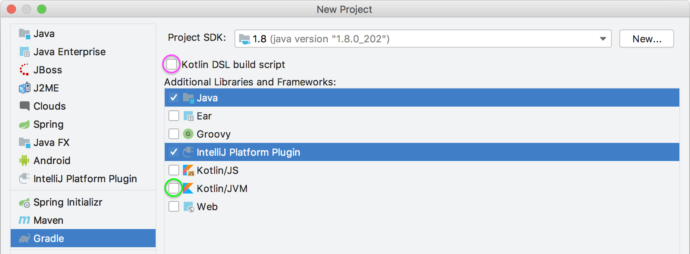
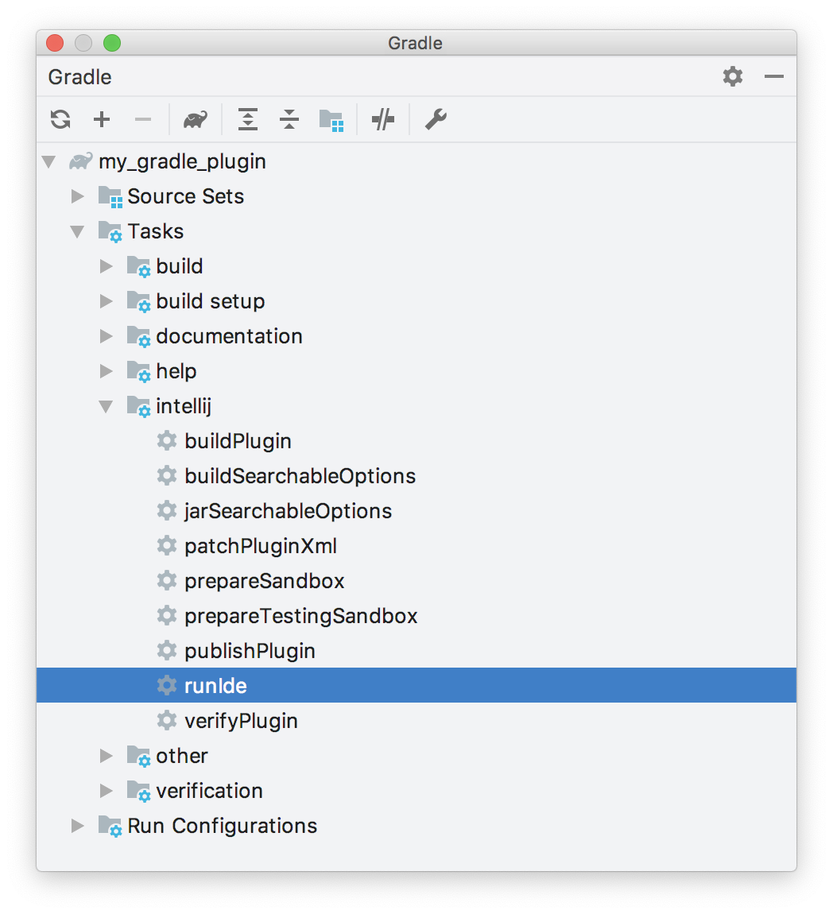

<!-- Copyright 2000-2020 JetBrains s.r.o. and other contributors. Use of this source code is governed by the Apache 2.0 license that can be found in the LICENSE file. -->

Gradle is the preferred solution for creating Consulo plugins.
Consulo bundles the necessary plugins to support Gradle-based development.

> **WARNING** When adding additional repositories to your Gradle build script, always use HTTPS protocol.

* bullet list
{:toc}

## Creating a Gradle-Based Consulo Plugin with New Project Wizard
Creating new Gradle-based Consulo plugin projects is performed using the New Project Wizard.
The Wizard creates all the necessary project files based on a few template inputs.

Before creating a new Gradle project, familiarize yourself with creating general Gradle projects in Consulo.
This page emphasizes the steps in the process of creating Consulo plugin projects that are Gradle-based.

> **WARNING** Please note that Gradle 6.1 has a [known bug](https://github.com/gradle/gradle/issues/11966) that prevents using it for developing plugins, please upgrade to 6.1.1 or later.

Launch the New Project Wizard.
It guides you through the Gradle project creation process with two screens.

### New Project Configuration Screen
On the first screen, the type of project is configured:
* From the _project type_ pane on the left, choose _Gradle_.
* Specify the _Project SDK_ based on the **Java 8** JDK.
  This SDK will be the default JRE used to run Gradle, and the JDK version used to compile the plugin Java sources.

> **NOTE** When targeting 2020.3 and later only, using Java 11 is now required.

* In the _Additional Libraries and Frameworks_ panel, select _Java_ and _Consulo Plugin_.
  These settings will be used for the remainder of this tutorial.

Optionally:
* To include support for the Kotlin language in the plugin, check the _Kotlin/JVM_ box (circled in green below).
  This option can be selected with or without the _Java_ language.
* To create the `build.gradle` file as a Kotlin build script (`build.gradle.kts`) rather than Groovy, check the _Kotlin DSL build script_ box (circled in magenta below).

Then click _Next_:

{:width="800px"}

### Project Naming/Artifact Coordinates Screen
Expand the _Artifact Coordinates_ section and specify a GroupId, ArtifactId, and Version using [Maven naming](https://maven.apache.org/guides/mini/guide-naming-conventions.html) conventions.
* _GroupId_ is typically a Java package name, and it is used for the Gradle property `project.group` value in the project's `build.gradle` file.
  For this example, enter `com.your.company`.
* _ArtifactId_ is the default name of the project JAR file (without version).
  It is also used for the Gradle property `rootProject.name` value in the project's `settings.gradle` file.
  For this example, enter `my_gradle_plugin`.
* _Version_ is used for the Gradle property `project.version` value in the `build.gradle` file.
  For this example, enter `1.0`.

The _Name_ field is synced automatically with the specified _ArtifactId_.

Specify the path for the new project in _Location_ and click _Finish_ to continue and generate the project.


### Components of a Wizard-Generated Gradle Consulo Plugin
For the [example](#creating-a-gradle-based-consulo-plugin-with-new-project-wizard) `my_gradle_plugin`, the New Project Wizard creates the following directory content:

```text
my_gradle_plugin
├── build.gradle
├── gradle
│   └── wrapper
│       ├── gradle-wrapper.jar
│       └── gradle-wrapper.properties
├── gradlew
├── gradlew.bat
├── settings.gradle
└── src
    ├── main
    │   ├── java
    │   └── resources
    │       └── META-INF
    │           └── plugin.xml
    └── test
        ├── java
        └── resources
```

* The default Consulo `build.gradle` file (see next paragraph).
* The Gradle Wrapper files, and in particular the `gradle-wrapper.properties` file, which specifies the version of the Gradle to be used to build the plugin.
  If needed, the Consulo Gradle plugin downloads the version of the Gradle specified in this file.
* The `settings.gradle` file, containing a definition of the `rootProject.name`.
* The `META-INF` directory under the default `main` [SourceSet](https://docs.gradle.org/current/userguide/java_plugin.html#sec:java_project_layout) contains the plugin [configuration file](/basics/plugin_structure/plugin_configuration_file.md).


The generated `my_gradle_plugin` project `build.gradle` file:

```groovy
  plugins {
      id 'java'
      id 'consulo.plugin' version '0.6.5'
  }

  group 'com.your.company'
  version '1.0'
  sourceCompatibility = 1.8

  repositories {
      mavenCentral()
  }
  dependencies {
      testImplementation group: 'junit', name: 'junit', version: '4.12'
  }

  // Consulo plugin configuration
  intellij {
      version '2020.1'
  }
  patchPluginXml {
      changeNotes """
        Add change notes here.<br>
        <em>most HTML tags may be used</em>"""
  }
```

* Two plugins to Gradle are explicitly declared:
  * The [Gradle Java](https://docs.gradle.org/current/userguide/java_plugin.html) plugin.
  * The Consulo Gradle plugin.
* The _GroupId_ from the Wizard [Project Naming/Artifact Coordinates Screen](#project-namingartifact-coordinates-screen) is the `project.group` value.
* The _Version_ from the Wizard [Project Naming/Artifact Coordinates Screen](#project-namingartifact-coordinates-screen) is the `project.version` value.
* The `sourceCompatibility` line is injected to enforce using Java 8 JDK to compile Java sources.
* The only comment in the file is a reference to the Consulo plugin configuration DSL.
* The value of the Setup DSL attribute `intellij.version` specifies the version of the Consulo to be used to build the plugin.
  It defaults to the version of Consulo that was used to run the New Project Wizard.
* The value of the Patching DSL attribute `patchPluginXml.changeNotes` is set to a place holder text.


#### Plugin Gradle Properties and Plugin Configuration File Elements
The Gradle properties `rootProject.name` and `project.group` will not, in general, match the respective [plugin configuration file](/basics/plugin_structure/plugin_configuration_file.md) `plugin.xml` elements `<name>` and `<id>`.
There is no Consulo-related reason they should as they serve different functions.

The `<name>` element (used as the plugin's display name) is often the same as `rootProject.name`, but it can be more explanatory.

The `<id>` value must be a unique identifier over all plugins, typically a concatenation of the specified _GroupId_ and _ArtifactId_.
Please note that it is impossible to change the `<id>` of a published plugin without losing automatic updates for existing installations.

## Adding Gradle Support to an Existing DevKit-Based Consulo Plugin
Converting a [DevKit-based](/basics/getting_started/using_dev_kit.md) plugin project to a Gradle-based plugin project can be done using the New Project Wizard to create a Gradle-based project around the existing DevKit-based project:
* Ensure the directory containing the DevKit-based Consulo plugin project can be fully recovered if necessary.
* Delete all the artifacts of the DevKit-based project:
  * `.idea` directory
  * `[modulename].iml` file
  * `out` directory
* Arrange the existing source files within the project directory in the Gradle [SourceSet](https://docs.gradle.org/current/userguide/java_plugin.html#sec:java_project_layout) format.
* Use the New Project Wizard as though creating a [new Gradle project](#creating-a-gradle-based-consulo-plugin-with-new-project-wizard) from scratch.
* On the [Project Naming/Artifact Coordinates Screen](#project-namingartifact-coordinates-screen) set the values to:
  * _GroupId_ to the existing package in the initial source set.
  * _ArtifactId_ to the name of the existing plugin.
  * _Version_ to the same as the existing plugin.
  * _Name_ to the name of the existing plugin.
    (It should be pre-filled from the _ArtifactId_)
  * Set the _Location_ to the directory of the existing plugin.
* Click _Finish_ to create the new Gradle-based plugin.
* Add more modules using Gradle _Source Sets_ as needed.


## Running a Simple Gradle-Based Consulo Plugin
Gradle projects are run from the IDE's Gradle Tool window.

### Adding Code to the Project
Before running [`my_gradle_project`](#components-of-a-wizard-generated-gradle-consulo-plugin), some code can be added to provide simple functionality.
See the [Creating Actions](/tutorials/action_system/working_with_custom_actions.md) tutorial for step-by-step instructions for adding a menu action.

### Executing the Plugin
Open the Gradle tool window and search for the `runIde` task:
* If it’s not in the list, hit the Refresh button at the top of the Gradle window.
* Or create a new Gradle Run Configuration.

{:width="398px"}

Double-click on the _runIde_ task to execute it.
See the Consulo documentation for more information about working with Gradle tasks.

Finally, when `my_gradle_plugin` launches in the IDE development instance, there should be a new menu under the **Tools** menu.
