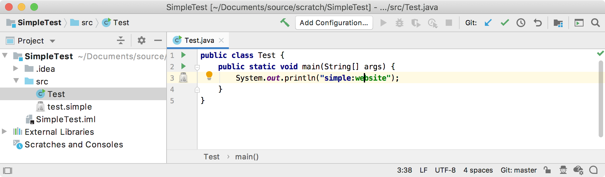
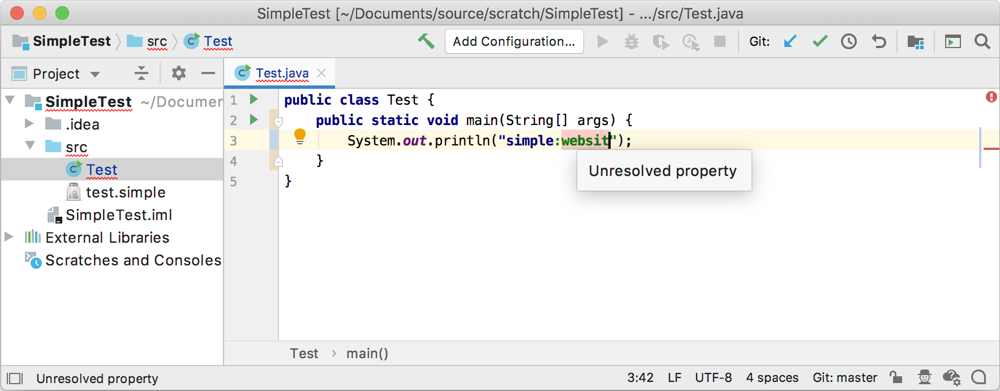

<!-- Copyright 2000-2020 JetBrains s.r.o. and other contributors. Use of this source code is governed by the Apache 2.0 license that can be found in the LICENSE file. -->

An `Annotator` helps highlight and annotate any code based on specific rules.
This section adds annotation functionality to support the Simple Language in the context of Java code.

**Reference**: [Annotator](/reference_guide/custom_language_support/syntax_highlighting_and_error_highlighting.md#annotator)

* bullet list
{:toc}

## Required Project Configuration Changes
Classes defined in this step of the tutorial depend on `consulo.language.psi.PsiLiteralExpression` at runtime.
Using `PsiLiteralExpression` [introduces a dependency](/basics/getting_started/plugin_compatibility.md#modules-specific-to-functionality) on `consulo.modules.java`.
Beginning in version 2019.2 of the Consulo these dependencies are declared in `plugin.xml`:

```xml
  <depends>consulo.modules.java</depends>
```

The dependency is also declared in the `pom.xml` file as a Maven dependency:

```xml
<dependency>
    <groupId>consulo</groupId>
    <artifactId>consulo-java</artifactId>
    <version>${consulo.version}</version>
    <scope>provided</scope>
</dependency>
```

## 7.1. Define an Annotator
The `SimpleAnnotator` subclasses [`Annotator`](https://github.com/consulo/consulo/blob/master/modules/base/language-editor-api/src/main/java/consulo/language/editor/annotation/Annotator.java).
Consider a literal string that starts with "simple:" as a prefix of a Simple Language key.
It isn't part of the Simple Language, but it is a useful convention for detecting Simple Language keys embedded as string literals in other languages, like Java.
Annotate the `simple:key` literal expression, and differentiate between a well-formed vs. an unresolved property.

> **NOTE** The use of new `AnnotationHolder` syntax starting 2020.2, which uses the builder format.

```java

```

> **TIP** If the above code is copied at this stage of the tutorial, then remove the line below the comment "** Tutorial step 18.3 …" The quick fix class in that line is not defined until later in the tutorial.

## 7.2. Register the Annotator
The `SimpleAnnotator` implementation is registered with the Consulo by annotating the class with `@ExtensionImpl`. The base interface `Annotator` is annotated with `@ExtensionAPI`, so the Consulo discovers the implementation automatically.

## 7.3. Run the Project
As a test, define the following Java file containing a Simple Language `prefix:value` pair:

```java
public class Test {
    public static void main(String[] args) {
        System.out.println("simple:website");
    }
}
```

Open this Java file in an IDE Development Instance running the `simple_language_plugin` to check if the IDE resolves a property:

{:width="800px"}

If the property is an undefined name, the annotator flags the code with an error.

{:width="800px"}

Try changing the Simple Language [color settings](/tutorials/custom_language_support/syntax_highlighter_and_color_settings_page.md#run-the-project-1) to differentiate the annotation from the default language color settings.
