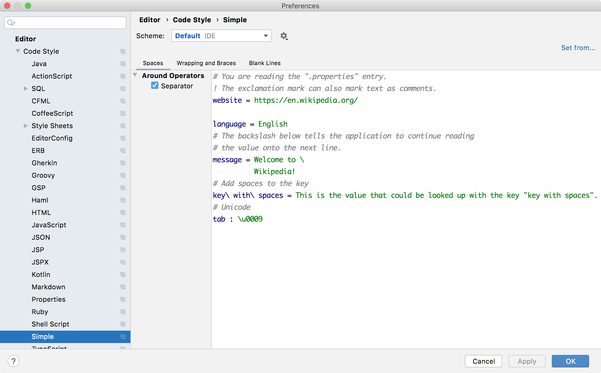

<!-- Copyright 2000-2025 JetBrains s.r.o. and other contributors. Use of this source code is governed by the Apache 2.0 license that can be found in the LICENSE file. -->

Code style settings enable defining formatting options.
A code style settings provider creates an instance of the settings and also creates an options page in settings/preferences.
This example creates a settings/preferences page that uses the default language code style settings, customized by a language code style settings provider.

**Reference**: [Code Style Settings](/reference_guide/custom_language_support/code_formatting.md#code-style-settings)


## 16.1. Define Code Style Settings
Define a code style settings for Simple Language by subclassing `CustomCodeStyleSettings`.

```java
package org.consulo.sdk.language;

import consulo.language.codeStyle.CodeStyleSettings;
import consulo.language.codeStyle.CustomCodeStyleSettings;

public class SimpleCodeStyleSettings extends CustomCodeStyleSettings {

  public SimpleCodeStyleSettings(CodeStyleSettings settings) {
    super("SimpleCodeStyleSettings", settings);
  }

}
```

## 16.2. Define Code Style Settings Provider
The code style settings provider gives the Consulo a standard way to instantiate `CustomCodeStyleSettings` for the Simple Language.
Define a code style settings provider for Simple Language by subclassing `CodeStyleSettingsProvider`.

```java
package org.consulo.sdk.language;

import consulo.annotation.component.ExtensionImpl;
import consulo.language.codeStyle.CodeStyleSettings;
import consulo.language.codeStyle.CustomCodeStyleSettings;
import consulo.language.codeStyle.setting.CodeStyleAbstractConfigurable;
import consulo.language.codeStyle.setting.CodeStyleAbstractPanel;
import consulo.language.codeStyle.setting.CodeStyleConfigurable;
import consulo.language.codeStyle.setting.CodeStyleSettingsProvider;
import consulo.language.codeStyle.setting.TabbedLanguageCodeStylePanel;

import jakarta.annotation.Nonnull;

@ExtensionImpl
final class SimpleCodeStyleSettingsProvider extends CodeStyleSettingsProvider {

  @Override
  public CustomCodeStyleSettings createCustomSettings(@Nonnull CodeStyleSettings settings) {
    return new SimpleCodeStyleSettings(settings);
  }

  @Override
  public String getConfigurableDisplayName() {
    return "Simple";
  }

  @Nonnull
  public CodeStyleConfigurable createConfigurable(@Nonnull CodeStyleSettings settings,
                                                  @Nonnull CodeStyleSettings modelSettings) {
    return new CodeStyleAbstractConfigurable(settings, modelSettings, this.getConfigurableDisplayName()) {
      @Nonnull
      @Override
      protected CodeStyleAbstractPanel createPanel(@Nonnull CodeStyleSettings settings) {
        return new SimpleCodeStyleMainPanel(getCurrentSettings(), settings);
      }
    };
  }

  private static class SimpleCodeStyleMainPanel extends TabbedLanguageCodeStylePanel {

    public SimpleCodeStyleMainPanel(CodeStyleSettings currentSettings, CodeStyleSettings settings) {
      super(SimpleLanguage.INSTANCE, currentSettings, settings);
    }

  }

}
```

## 16.3. Register the Code Style Settings Provider
The `SimpleCodeStyleSettingsProvider` implementation is registered with the Consulo by annotating the class with `@ExtensionImpl`. The base class `CodeStyleSettingsProvider` is annotated with `@ExtensionAPI`, so the Consulo discovers the implementation automatically.

## 16.4. Define the Language Code Style Settings Provider
Define a code style settings provider for Simple Language by subclassing `LanguageCodeStyleSettingsProvider`, which provides common code style settings for a specific language.

```java
package org.consulo.sdk.language;

import consulo.annotation.component.ExtensionImpl;
import consulo.language.Language;
import consulo.language.codeStyle.setting.CodeStyleSettingsCustomizable;
import consulo.language.codeStyle.setting.LanguageCodeStyleSettingsProvider;

import jakarta.annotation.Nonnull;

@ExtensionImpl
final class SimpleLanguageCodeStyleSettingsProvider extends LanguageCodeStyleSettingsProvider {

  @Nonnull
  @Override
  public Language getLanguage() {
    return SimpleLanguage.INSTANCE;
  }

  @Override
  public void customizeSettings(@Nonnull CodeStyleSettingsCustomizable consumer, @Nonnull SettingsType settingsType) {
    if (settingsType == SettingsType.SPACING_SETTINGS) {
      consumer.showStandardOptions("SPACE_AROUND_ASSIGNMENT_OPERATORS");
      consumer.renameStandardOption("SPACE_AROUND_ASSIGNMENT_OPERATORS", "Separator");
    } else if (settingsType == SettingsType.BLANK_LINES_SETTINGS) {
      consumer.showStandardOptions("KEEP_BLANK_LINES_IN_CODE");
    }
  }

  @Override
  public String getCodeSample(@Nonnull SettingsType settingsType) {
    return "# You are reading the \".properties\" entry.\n" +
        "! The exclamation mark can also mark text as comments.\n" +
        "website = https://en.wikipedia.org/\n" +
        "\n" +
        "language = English\n" +
        "# The backslash below tells the application to continue reading\n" +
        "# the value onto the next line.\n" +
        "message = Welcome to \\\n" +
        "          Wikipedia!\n" +
        "# Add spaces to the key\n" +
        "key\\ with\\ spaces = This is the value that could be looked up with the key \"key with spaces\".\n" +
        "# Unicode\n" +
        "tab : \\u0009";
  }

}
```

## 16.5. Register the Language Code Style Settings Provider
The `SimpleLanguageCodeStyleSettingsProvider` implementation is registered with the Consulo by annotating the class with `@ExtensionImpl`. The base class `LanguageCodeStyleSettingsProvider` is annotated with `@ExtensionAPI`, so the Consulo discovers the implementation automatically.

## 16.6. Run the Project
In the IDE Development Instance, open the Simple Language code formatting page: **Preferences/Settings \| Editor \| Code Style \| Simple**.


