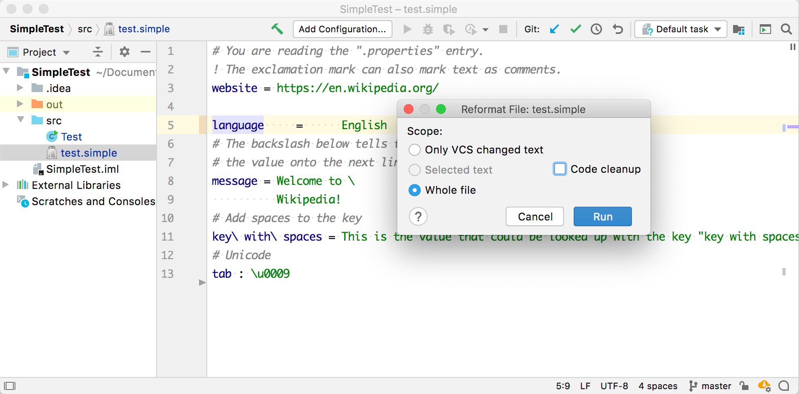

<!-- Copyright 2000-2025 JetBrains s.r.o. and other contributors. Use of this source code is governed by the Apache 2.0 license that can be found in the LICENSE file. -->

The Consulo includes a powerful framework for implementing formatting for custom languages.
A formatter enables reformatting code automatically based on code style settings.
The formatter controls spaces, indents, wrap, and alignment.

**Reference**: [Code Formatter](/reference_guide/custom_language_support/code_formatting.md)

* bullet list
{:toc}

## 15.1. Define a Block
The formatting model represents the formatting structure of a file as a tree of `Block` objects, with associated indent, wrap, alignment and spacing settings.
The goal is to cover each PSI element with such a block.
Since each block builds its children's blocks, it can generate extra blocks or skip any PSI elements.
Define `SimpleBlock` based on `AbstractBlock`.

```java
package org.consulo.sdk.language;

import consulo.language.ast.ASTNode;
import consulo.language.ast.TokenType;
import consulo.language.codeStyle.*;

import jakarta.annotation.Nonnull;
import jakarta.annotation.Nullable;

import java.util.ArrayList;
import java.util.List;

public class SimpleBlock extends AbstractBlock {

  private final SpacingBuilder spacingBuilder;

  protected SimpleBlock(@Nonnull ASTNode node, @Nullable Wrap wrap, @Nullable Alignment alignment,
                        SpacingBuilder spacingBuilder) {
    super(node, wrap, alignment);
    this.spacingBuilder = spacingBuilder;
  }

  @Override
  protected List<Block> buildChildren() {
    List<Block> blocks = new ArrayList<>();
    ASTNode child = myNode.getFirstChildNode();
    while (child != null) {
      if (child.getElementType() != TokenType.WHITE_SPACE) {
        Block block = new SimpleBlock(child, Wrap.createWrap(WrapType.NONE, false), Alignment.createAlignment(),
            spacingBuilder);
        blocks.add(block);
      }
      child = child.getTreeNext();
    }
    return blocks;
  }

  @Override
  public Indent getIndent() {
    return Indent.getNoneIndent();
  }

  @Nullable
  @Override
  public Spacing getSpacing(@Nullable Block child1, @Nonnull Block child2) {
    return spacingBuilder.getSpacing(this, child1, child2);
  }

  @Override
  public boolean isLeaf() {
    return myNode.getFirstChildNode() == null;
  }

}
```

## 15.2. Define a Formatting Model Builder
Define a formatter that removes extra spaces except for the single spaces around the property separator.
For example, reformat "foo  = &nbsp;&nbsp;&nbsp;&nbsp;bar" to "foo = bar".

Create `SimpleFormattingModelBuilder` by subclassing [`FormattingModelBuilder`](https://github.com/consulo/consulo/blob/master/modules/base/language-code-style-api/src/main/java/consulo/language/codeStyle/FormattingModelBuilder.java).

```java
package org.consulo.sdk.language;

import consulo.annotation.component.ExtensionImpl;
import consulo.language.Language;
import consulo.language.codeStyle.*;
import org.consulo.sdk.language.psi.SimpleTypes;

import jakarta.annotation.Nonnull;

@ExtensionImpl
final class SimpleFormattingModelBuilder implements FormattingModelBuilder {

  @Nonnull
  @Override
  public Language getLanguage() {
    return SimpleLanguage.INSTANCE;
  }

  private static SpacingBuilder createSpaceBuilder(CodeStyleSettings settings) {
    return new SpacingBuilder(settings, SimpleLanguage.INSTANCE)
        .around(SimpleTypes.SEPARATOR)
        .spaceIf(settings.getCommonSettings(SimpleLanguage.INSTANCE.getID()).SPACE_AROUND_ASSIGNMENT_OPERATORS)
        .before(SimpleTypes.PROPERTY)
        .none();
  }

  @Nonnull
  @Override
  public FormattingModel createModel(@Nonnull FormattingContext formattingContext) {
    final CodeStyleSettings codeStyleSettings = formattingContext.getCodeStyleSettings();
    return FormattingModelProvider
        .createFormattingModelForPsiFile(formattingContext.getContainingFile(),
            new SimpleBlock(formattingContext.getNode(),
                Wrap.createWrap(WrapType.NONE, false),
                Alignment.createAlignment(),
                createSpaceBuilder(codeStyleSettings)),
            codeStyleSettings);
  }

}
```

## 15.3. Register the Formatter
The `SimpleFormattingModelBuilder` implementation is registered with the Consulo by annotating the class with `@ExtensionImpl`. The base interface `FormattingModelBuilder` is annotated with `@ExtensionAPI`, so the Consulo discovers the implementation automatically.

## 15.4. Run the Project
Add some extra spaces around the `=` separator between `language` and `English`.
Reformat the code by selecting **Code \| Show Reformat File Dialog** and choose **Run**.


