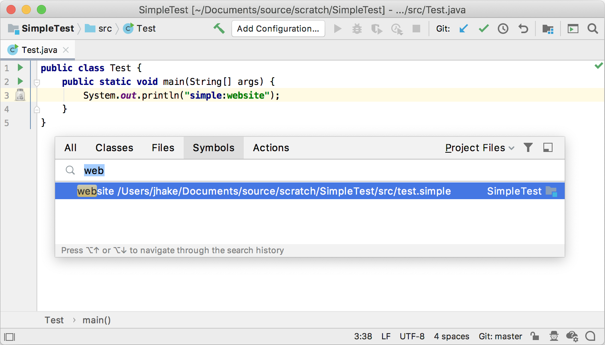

<!-- Copyright 2000-2025 JetBrains s.r.o. and other contributors. Use of this source code is governed by the Apache 2.0 license that can be found in the LICENSE file. -->

A _Go to Symbol Contributor_ helps the user to navigate to any PSI element by its name.

**Reference**: [Go to Class and Go to Symbol](/reference_guide/custom_language_support/go_to_class_and_go_to_symbol.md)


## 13.1. Define a Helper Method for Generated PSI Elements
To specify how a PSI element looks like in the **Go To Symbol** popup window, **Structure** tool window, or other components, it should implement `getPresentation()`.
This method gets defined in the utility class `SimplePsiImplUtil`, and the parser and PSI classes must be regenerated.
Add the following method to `SimplePsiImplUtil`:

```java
public static ItemPresentation getPresentation(final SimpleProperty element) {
    return new ItemPresentation() {
        @Nullable
        @Override
        public String getPresentableText() {
            return element.getKey();
        }

        @Nullable
        @Override
        public String getLocationString() {
            return element.getContainingFile().getName();
        }

        @Nullable
        @Override
        public Icon getIcon(boolean unused) {
            return SimpleIcons.FILE;
        }
    };
}
```

## 13.2. Update Grammar and Regenerate the Parser
Now add the `SimplePsiImplUtil.getPresentation()` to the `property` methods definition in the `Simple.bnf` grammar file by replacing the `property` definition with the lines below.
Don't forget to regenerate the parser after updating the file!
Right-click on the `Simple.bnf` file and select **Generate Parser Code**.

```java
property ::= (KEY? SEPARATOR VALUE?) | KEY {
  mixin="org.consulo.sdk.language.psi.impl.SimpleNamedElementImpl"
  implements="org.consulo.sdk.language.psi.SimpleNamedElement"
  methods=[getKey getValue getName setName getNameIdentifier getPresentation]
}
```

## 13.3. Define a Go to Symbol Contributor
To enable the `simple_language_plugin` to contribute items to **Navigate \| Class..., File..., Symbol...** lists, subclass `ChooseByNameContributor` to create `SimpleChooseByNameContributor`:

```java
package org.consulo.sdk.language;

import consulo.annotation.component.ExtensionImpl;
import consulo.ide.navigation.ChooseByNameContributorEx;
import consulo.language.psi.scope.GlobalSearchScope;
import consulo.language.psi.stub.IdFilter;
import consulo.navigation.NavigationItem;
import consulo.project.Project;
import consulo.util.collection.ContainerUtil;
import org.consulo.sdk.language.psi.SimpleProperty;

import jakarta.annotation.Nonnull;
import jakarta.annotation.Nullable;

import java.util.List;
import java.util.Objects;
import java.util.function.Predicate;

@ExtensionImpl
final class SimpleChooseByNameContributor implements ChooseByNameContributorEx {

  @Override
  public void processNames(@Nonnull Predicate<String> processor,
                           @Nonnull GlobalSearchScope scope,
                           @Nullable IdFilter filter) {
    Project project = Objects.requireNonNull(scope.getProject());
    List<String> propertyKeys = ContainerUtil.map(
        SimpleUtil.findProperties(project), SimpleProperty::getKey);
    for (String key : propertyKeys) {
      if (!processor.test(key)) break;
    }
  }

  @Override
  public void processElementsWithName(@Nonnull String name,
                                      @Nonnull Predicate<NavigationItem> processor,
                                      @Nonnull FindSymbolParameters parameters) {
    List<NavigationItem> properties = ContainerUtil.map(
        SimpleUtil.findProperties(parameters.getProject(), name),
        property -> (NavigationItem) property);
    for (NavigationItem item : properties) {
      if (!processor.test(item)) break;
    }
  }

}
```

## 13.4. Register the Go To Symbol Contributor
The `SimpleChooseByNameContributor` implementation is registered with the Consulo by annotating the class with `@ExtensionImpl`. The base interface `ChooseByNameContributor` is annotated with `@ExtensionAPI`, so the Consulo discovers the implementation automatically.

## 13.5. Run the Project
Rebuild the project, and run `simple_language_plugin` in a Development Instance.
The IDE now supports navigating to a property definition by name pattern via **Navigate \| Symbol** action.


