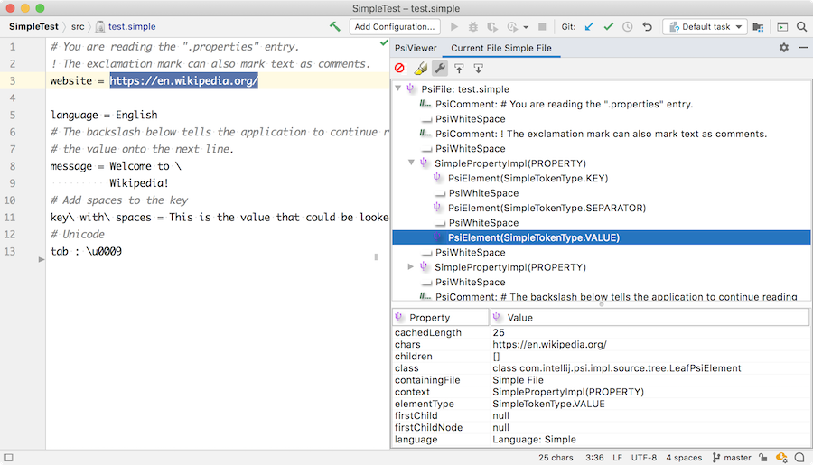

<!-- Copyright 2000-2025 JetBrains s.r.o. and other contributors. Use of this source code is governed by the Apache 2.0 license that can be found in the LICENSE file. -->

The lexical analyzer defines how the contents of a file are broken into tokens, which is the basis for supporting custom language features.
The easiest way to create a lexer is to use [JFlex](https://jflex.de/).

**Reference**: [Implementing Lexer](/reference_guide/custom_language_support/implementing_lexer.md)


## Required Project Configuration Change
The previous tutorial step [Grammar and Parser](grammar_and_parser.md), and this page, generate source files in the directory `src/main/gen`.
To include those files in a Maven project, add the `build-helper-maven-plugin` to your `pom.xml` to register the additional source directory:

```xml
<plugin>
    <groupId>org.codehaus.mojo</groupId>
    <artifactId>build-helper-maven-plugin</artifactId>
    <executions>
        <execution>
            <phase>generate-sources</phase>
            <goals>
                <goal>add-source</goal>
            </goals>
            <configuration>
                <sources>
                    <source>src/main/gen</source>
                </sources>
            </configuration>
        </execution>
    </executions>
</plugin>
```

## 4.1. Define a Lexer
Define a `Simple.flex` file with rules for the Simple Language lexer, as demonstrated in `org.consulo.sdk.language.Simple.flex`.

```java
package org.consulo.sdk.language;

import consulo.language.lexer.FlexLexer;
import consulo.language.ast.IElementType;
import org.consulo.sdk.language.psi.SimpleTypes;
import consulo.language.ast.TokenType;

%%

%class SimpleLexer
%implements FlexLexer
%unicode
%function advance
%type IElementType
%eof{  return;
%eof}

CRLF=\R
WHITE_SPACE=[\ \n\t\f]
FIRST_VALUE_CHARACTER=[^ \n\f\\] | "\\"{CRLF} | "\\".
VALUE_CHARACTER=[^\n\f\\] | "\\"{CRLF} | "\\".
END_OF_LINE_COMMENT=("#"|"!")[^\r\n]*
SEPARATOR=[:=]
KEY_CHARACTER=[^:=\ \n\t\f\\] | "\\ "

%state WAITING_VALUE

%%

<YYINITIAL> {END_OF_LINE_COMMENT}                           { yybegin(YYINITIAL); return SimpleTypes.COMMENT; }

<YYINITIAL> {KEY_CHARACTER}+                                { yybegin(YYINITIAL); return SimpleTypes.KEY; }

<YYINITIAL> {SEPARATOR}                                     { yybegin(WAITING_VALUE); return SimpleTypes.SEPARATOR; }

<WAITING_VALUE> {CRLF}({CRLF}|{WHITE_SPACE})+               { yybegin(YYINITIAL); return TokenType.WHITE_SPACE; }

<WAITING_VALUE> {WHITE_SPACE}+                              { yybegin(WAITING_VALUE); return TokenType.WHITE_SPACE; }

<WAITING_VALUE> {FIRST_VALUE_CHARACTER}{VALUE_CHARACTER}*   { yybegin(YYINITIAL); return SimpleTypes.VALUE; }

({CRLF}|{WHITE_SPACE})+                                     { yybegin(YYINITIAL); return TokenType.WHITE_SPACE; }

[^]                                                         { return TokenType.BAD_CHARACTER; }
```

## 4.2. Generate a Lexer Class
Now generate a lexer class via **JFlex Generator** from the context menu on `Simple.flex` file.

The Grammar-Kit plugin uses the JFlex lexer generation.
When running for the first time, JFlex prompts for a destination folder to download the JFlex library and skeleton.
Choose the project root directory, for example `code_samples/simple_language_plugin`.

After that, the IDE generates the lexer under the `gen` directory, for example in `simple_language_plugin/src/main/gen/org/consulo/sdk/language/SimpleLexer`.

::: tip
The `maven-consulo-plugin` can be used to automate parser generation as part of the Maven build.
:::


See [Implementing Lexer](/reference_guide/custom_language_support/implementing_lexer.md) for more information about using _JFlex_ with the Consulo.

## 4.3. Define a Lexer Adapter
The JFlex lexer needs to be adapted to the Consulo Lexer API.
This is done by subclassing `FlexAdapter`.

```java
package org.consulo.sdk.language;

import consulo.language.lexer.FlexAdapter;

public class SimpleLexerAdapter extends FlexAdapter {

  public SimpleLexerAdapter() {
    super(new SimpleLexer(null));
  }

}
```

## 4.4. Define a Root File
The `SimpleFile` implementation is the top-level node of the [tree of `PsiElements`](/reference_guide/custom_language_support/implementing_parser_and_psi.md) for a Simple Language file.

```java
package org.consulo.sdk.language.psi;

import consulo.language.impl.psi.PsiFileBase;
import consulo.virtualFileSystem.fileType.FileType;
import consulo.language.psi.FileViewProvider;
import org.consulo.sdk.language.SimpleFileType;
import org.consulo.sdk.language.SimpleLanguage;

import jakarta.annotation.Nonnull;

public class SimpleFile extends PsiFileBase {

  public SimpleFile(@Nonnull FileViewProvider viewProvider) {
    super(viewProvider, SimpleLanguage.INSTANCE);
  }

  @Nonnull
  @Override
  public FileType getFileType() {
    return SimpleFileType.INSTANCE;
  }

  @Override
  public String toString() {
    return "Simple File";
  }

}
```

## 4.5. Define a Parser
The Simple Language parser is defined by subclassing [`ParserDefinition`](https://github.com/consulo/consulo/blob/master/modules/base/language-api/src/main/java/consulo/language/parser/ParserDefinition.java).

```java
package org.consulo.sdk.language;

import consulo.annotation.component.ExtensionImpl;
import consulo.language.Language;
import consulo.language.ast.ASTNode;
import consulo.language.ast.IFileElementType;
import consulo.language.ast.TokenSet;
import consulo.language.lexer.Lexer;
import consulo.language.parser.ParserDefinition;
import consulo.language.parser.PsiParser;
import consulo.language.psi.PsiElement;
import consulo.language.psi.PsiFile;
import consulo.language.psi.FileViewProvider;
import consulo.project.Project;
import org.consulo.sdk.language.parser.SimpleParser;
import org.consulo.sdk.language.psi.SimpleFile;
import org.consulo.sdk.language.psi.SimpleTokenSets;
import org.consulo.sdk.language.psi.SimpleTypes;

import jakarta.annotation.Nonnull;

@ExtensionImpl
final class SimpleParserDefinition implements ParserDefinition {

  public static final IFileElementType FILE = new IFileElementType(SimpleLanguage.INSTANCE);

  @Nonnull
  @Override
  public Language getLanguage() {
    return SimpleLanguage.INSTANCE;
  }

  @Nonnull
  @Override
  public Lexer createLexer(Project project) {
    return new SimpleLexerAdapter();
  }

  @Nonnull
  @Override
  public TokenSet getCommentTokens() {
    return SimpleTokenSets.COMMENTS;
  }

  @Nonnull
  @Override
  public TokenSet getStringLiteralElements() {
    return TokenSet.EMPTY;
  }

  @Nonnull
  @Override
  public PsiParser createParser(final Project project) {
    return new SimpleParser();
  }

  @Nonnull
  @Override
  public IFileElementType getFileNodeType() {
    return FILE;
  }

  @Nonnull
  @Override
  public PsiFile createFile(@Nonnull FileViewProvider viewProvider) {
    return new SimpleFile(viewProvider);
  }

  @Nonnull
  @Override
  public PsiElement createElement(ASTNode node) {
    return SimpleTypes.Factory.createElement(node);
  }

}
```

## 4.6. Register the Parser Definition
The [`ParserDefinition`](https://github.com/consulo/consulo/blob/master/modules/base/language-api/src/main/java/consulo/language/parser/ParserDefinition.java) interface is annotated with `@ExtensionAPI(ComponentScope.APPLICATION)`. To register the parser definition with the Consulo, annotate the `SimpleParserDefinition` implementation class with `@ExtensionImpl`.

## 4.7. Run the Project
With the `simple_language_plugin` loaded in a Development Instance, create a `test.simple` properties file with the following content:

```text
# You are reading the ".properties" entry.
! The exclamation mark can also mark text as comments.
website = https://en.wikipedia.org/
language = English
# The backslash below tells the application to continue reading
# the value onto the next line.
message = Welcome to \
          Wikipedia!
# Add spaces to the key
key\ with\ spaces = This is the value that could be looked up with the key "key with spaces".
# Unicode
tab : \u0009
```

Now open the *PsiViewer* tool window and check how the lexer breaks the content of the file into tokens, and the parser parsed the tokens into PSI elements.


