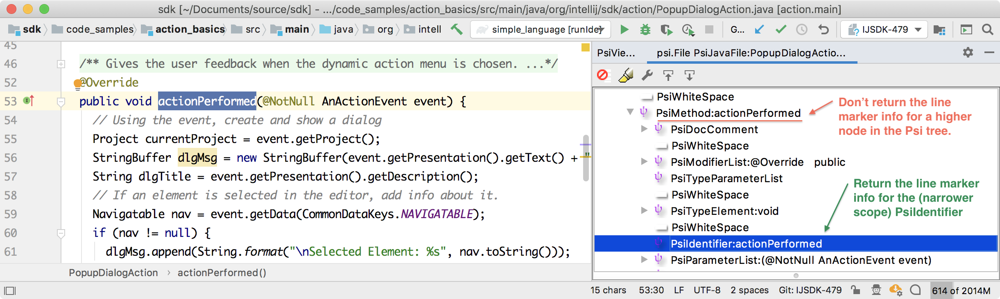
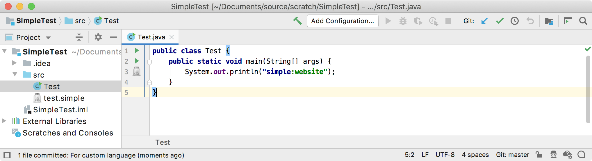

<!-- Copyright 2000-2025 JetBrains s.r.o. and other contributors. Use of this source code is governed by the Apache 2.0 license that can be found in the LICENSE file. -->

Line markers help annotate code with icons on the gutter.
These markers can provide navigation targets to related code.


## 8.1. Define a Line Marker Provider
A line marker provider annotates usages of Simple Language properties within Java code and provides navigation to the definition of these properties.
The visual marker is a Simple Language icon in the gutter of the Editor window.

The Simple Language marker provider subclasses `RelatedItemLineMarkerProvider`.
For this example, override the `collectNavigationMarkers()` method to collect usage of a Simple Language [key and separators](/tutorials/custom_language_support/language_and_filetype.md#define-the-language):

```java
package org.consulo.sdk.language;

import consulo.annotation.component.ExtensionImpl;
import consulo.language.Language;
import consulo.language.editor.gutter.RelatedItemLineMarkerInfo;
import consulo.language.editor.gutter.RelatedItemLineMarkerProvider;
import consulo.language.editor.gutter.NavigationGutterIconBuilder;
import consulo.language.psi.PsiElement;
import consulo.language.psi.PsiLiteralExpression;
import consulo.language.psi.impl.source.tree.java.PsiJavaTokenImpl;
import consulo.project.Project;
import org.consulo.sdk.language.psi.SimpleProperty;

import jakarta.annotation.Nonnull;

import java.util.Collection;
import java.util.List;

@ExtensionImpl
final class SimpleLineMarkerProvider extends RelatedItemLineMarkerProvider {

  @Nonnull
  @Override
  public Language getLanguage() {
    return SimpleLanguage.INSTANCE;
  }

  @Override
  protected void collectNavigationMarkers(@Nonnull PsiElement element,
                                          @Nonnull Collection<? super RelatedItemLineMarkerInfo<?>> result) {
    // This must be an element with a literal expression as a parent
    if (!(element instanceof PsiJavaTokenImpl) || !(element.getParent() instanceof PsiLiteralExpression literalExpression)) {
      return;
    }

    // The literal expression must start with the Simple language literal expression
    String value = literalExpression.getValue() instanceof String ? (String) literalExpression.getValue() : null;
    if ((value == null) ||
        !value.startsWith(SimpleAnnotator.SIMPLE_PREFIX_STR + SimpleAnnotator.SIMPLE_SEPARATOR_STR)) {
      return;
    }

    // Get the Simple language property usage
    Project project = element.getProject();
    String possibleProperties = value.substring(
        SimpleAnnotator.SIMPLE_PREFIX_STR.length() + SimpleAnnotator.SIMPLE_SEPARATOR_STR.length()
    );
    final List<SimpleProperty> properties = SimpleUtil.findProperties(project, possibleProperties);
    if (!properties.isEmpty()) {
      // Add the property to a collection of line marker info
      NavigationGutterIconBuilder<PsiElement> builder =
          NavigationGutterIconBuilder.create(SimpleIcons.FILE)
              .setTargets(properties)
              .setTooltipText("Navigate to Simple language property");
      result.add(builder.createLineMarkerInfo(element));
    }
  }

}
```

## 8.2. Best Practices for Implementing Line Marker Providers
This section addresses important details about implementing a marker provider.
The `collectNavigationMarkers()` method should:
* Only return line marker information consistent with the element passed into the method.
  For example, do not return a _class_ marker if `getLineMarkerInfo()` was called with an element that corresponds to a _method_.
* Return line marker information for the appropriate element at the correct scope of the PSI tree.
  For example, do not return method marker for `PsiMethod`.
  Instead, return it for the `PsiIdentifier` which contains the name of the method.



What happens when a `LineMarkerProvider` returns marker information for a `PsiElement` that is a higher node in the PSI tree?
For example, if `MyWrongLineMarkerProvider()` erroneously returns a `PsiMethod` instead of a `PsiIdentifier` element:

```java
public class MyWrongLineMarkerProvider implements LineMarkerProvider {
  public LineMarkerInfo getLineMarkerInfo(@NotNull PsiElement element) {
    if (element instanceof PsiMethod) return new LineMarkerInfo(element, ...);
    return null;
  }
}
```

The consequences of the `MyWrongLineMarkerProvider()` implementation have to do with how the Consulo performs inspections.
For performance reasons, inspection, and specifically the `LineMarkersPass` queries all `LineMarkerProviders` in two phases:
* The first pass is for all elements visible in the Editor window,
* The second pass is for the rest of the elements in the file.

If providers return nothing for either area, the line markers get cleared.
However, if a method like `actionPerformed()` is not completely visible in the Editor window (as shown in the image above,) and `MyWrongLineMarkerProvider()` returns marker info for the `PsiMethod` instead of `PsiIdentifier`, then:
* The first pass removes line marker info because whole `PsiMethod` isn't visible.
* The second pass tries to add a line marker because `MyWrongLineMarkerProvider()` is called for the `PsiMethod`.

As a result, _the line marker icon would blink annoyingly_.
To fix this problem, rewrite `MyWrongLineMarkerProvider` to return info for `PsiIdentifier` instead of `PsiMethod` as shown below:

```java
public class MyCorrectLineMarkerProvider implements LineMarkerProvider {
  public LineMarkerInfo getLineMarkerInfo(@NotNull PsiElement element) {
    if (element instanceof PsiIdentifier && element.getParent() instanceof PsiMethod) return new LineMarkerInfo(element, ...);
    return null;
  }
}
```

## 8.3. Register the Line Marker Provider
The `SimpleLineMarkerProvider` implementation is registered with the Consulo by annotating the class with `@ExtensionImpl`. The base class `RelatedItemLineMarkerProvider` (which implements `LineMarkerProvider`, annotated with `@ExtensionAPI`) allows the Consulo to discover the implementation automatically.

## 8.4. Run the Project
Run the `simple_language_plugin` in a Development Instance and open the [Test file](/tutorials/custom_language_support/annotator.md#run-the-project).
Now the icon appears next to line 3 on the gutter.
A user can click on the icon to navigate to the property definition.


