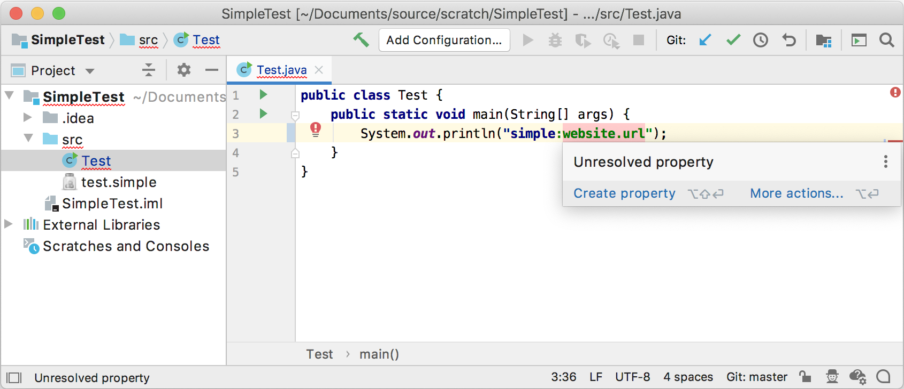
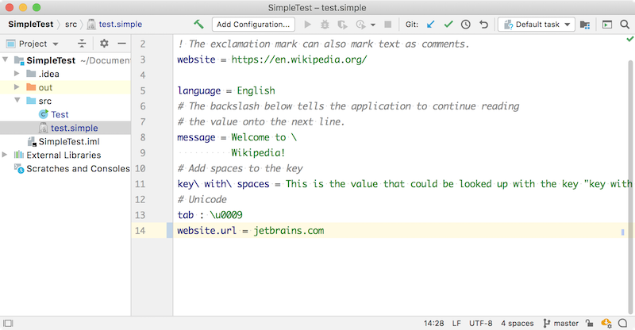

<!-- Copyright 2000-2020 JetBrains s.r.o. and other contributors. Use of this source code is governed by the Apache 2.0 license that can be found in the LICENSE file. -->

A quick fix for a custom language supports the Consulo-based IDE feature Intention Actions.
For the Simple Language, this tutorial adds a quick fix that helps to define an unresolved property from its usage.

**Reference**: [Code Inspections and Intentions](/reference_guide/custom_language_support/code_inspections_and_intentions.md)

* bullet list
{:toc}

## 18.1. Update the Element Factory
The `SimpleElementFactory` is updated to include two new methods to support the user choice of creating a new property for the Simple Language quick fix.
The new `createCRLF()` method supports adding a newline to the end of the [`test.simple`](/tutorials/custom_language_support/lexer_and_parser_definition.md#run-the-project) file before adding a new property.
A new overload of `createProperty()` creates a new `key`-`value` pair for Simple Language.

```java
package org.consulo.sdk.language.psi;

import consulo.language.psi.PsiElement;
import consulo.language.psi.PsiFileFactory;
import consulo.project.Project;
import org.consulo.sdk.language.SimpleFileType;

public class SimpleElementFactory {

  public static SimpleProperty createProperty(Project project, String name) {
    final SimpleFile file = createFile(project, name);
    return (SimpleProperty) file.getFirstChild();
  }

  public static SimpleFile createFile(Project project, String text) {
    String name = "dummy.simple";
    return (SimpleFile) PsiFileFactory.getInstance(project).createFileFromText(name, SimpleFileType.INSTANCE, text);
  }

  public static SimpleProperty createProperty(Project project, String name, String value) {
    final SimpleFile file = createFile(project, name + " = " + value);
    return (SimpleProperty) file.getFirstChild();
  }

  public static PsiElement createCRLF(Project project) {
    final SimpleFile file = createFile(project, "\n");
    return file.getFirstChild();
  }

}
```

## 18.2. Define an Intention Action
The `SimpleCreatePropertyQuickFix` creates a property in the file chosen by the user - in this case, a Java file containing a `prefix:key` - and navigate to this property after creation.
Under the hood, `SimpleCreatePropertyQuickFix` is an Intention Action.
For a more in-depth example of an Intention Action, see the `conditional_operator_intention` code sample.

```java
package org.consulo.sdk.language;

import consulo.application.Application;
import consulo.codeEditor.Editor;
import consulo.fileChooser.FileChooser;
import consulo.fileChooser.FileChooserDescriptor;
import consulo.fileChooser.FileChooserDescriptorFactory;
import consulo.fileEditor.FileEditorManager;
import consulo.language.ast.ASTNode;
import consulo.language.editor.intention.BaseIntentionAction;
import consulo.language.psi.PsiFile;
import consulo.language.psi.PsiManager;
import consulo.language.psi.search.FileTypeIndex;
import consulo.language.psi.scope.GlobalSearchScope;
import consulo.language.util.IncorrectOperationException;
import consulo.navigation.Navigatable;
import consulo.project.Project;
import consulo.undoRedo.WriteCommandAction;
import consulo.virtualFileSystem.VirtualFile;
import org.consulo.sdk.language.psi.SimpleElementFactory;
import org.consulo.sdk.language.psi.SimpleFile;
import org.consulo.sdk.language.psi.SimpleProperty;

import jakarta.annotation.Nonnull;

import java.util.Collection;

class SimpleCreatePropertyQuickFix extends BaseIntentionAction {

  private final String key;

  SimpleCreatePropertyQuickFix(String key) {
    this.key = key;
  }

  @Nonnull
  @Override
  public String getText() {
    return "Create property '" + key + "'";
  }

  @Nonnull
  @Override
  public String getFamilyName() {
    return "Create property";
  }

  @Override
  public boolean isAvailable(@Nonnull Project project, Editor editor, PsiFile file) {
    return true;
  }

  @Override
  public void invoke(@Nonnull final Project project, final Editor editor, PsiFile file) throws
      IncorrectOperationException {
    Application.get().invokeLater(() -> {
      Collection<VirtualFile> virtualFiles =
          FileTypeIndex.getFiles(SimpleFileType.INSTANCE, GlobalSearchScope.allScope(project));
      if (virtualFiles.size() == 1) {
        createProperty(project, virtualFiles.iterator().next());
      } else {
        final FileChooserDescriptor descriptor =
            FileChooserDescriptorFactory.createSingleFileDescriptor(SimpleFileType.INSTANCE);
        descriptor.setRoots(project.getBaseDir());
        final VirtualFile file1 = FileChooser.chooseFile(descriptor, project, null);
        if (file1 != null) {
          createProperty(project, file1);
        }
      }
    });
  }

  private void createProperty(final Project project, final VirtualFile file) {
    WriteCommandAction.writeCommandAction(project).run(() -> {
      SimpleFile simpleFile = (SimpleFile) PsiManager.getInstance(project).findFile(file);
      assert simpleFile != null;
      ASTNode lastChildNode = simpleFile.getNode().getLastChildNode();
      if (lastChildNode != null) {
        simpleFile.getNode().addChild(SimpleElementFactory.createCRLF(project).getNode());
      }
      SimpleProperty property = SimpleElementFactory.createProperty(project, key.replaceAll(" ", "\\\\ "), "");
      simpleFile.getNode().addChild(property.getNode());
      ((Navigatable) property.getLastChild().getNavigationElement()).navigate(true);
      Editor openEditor = FileEditorManager.getInstance(project).getSelectedTextEditor();
      assert openEditor != null;
      openEditor.getCaretModel().moveCaretRelatively(2, 0, false, false, false);
    });
  }

}
```

## 18.3. Update the Annotator
When a `badProperty` annotation is created, the `badProperty.registerFix()` method is called.
This method call registers the `SimpleCreatePropertyQuickFix` as the Intention Action for the Consulo to use to correct the problem.

```java
package org.consulo.sdk.language;

import consulo.colorScheme.DefaultLanguageHighlighterColors;
import consulo.document.util.TextRange;
import consulo.language.editor.annotation.AnnotationHolder;
import consulo.language.editor.annotation.Annotator;
import consulo.language.editor.annotation.HighlightSeverity;
import consulo.language.editor.inspection.ProblemHighlightType;
import consulo.language.psi.PsiElement;
import consulo.language.psi.PsiLiteralExpression;
import org.consulo.sdk.language.psi.SimpleProperty;

import jakarta.annotation.Nonnull;

import java.util.List;

final class SimpleAnnotator implements Annotator {

  public static final String SIMPLE_PREFIX_STR = "simple";
  public static final String SIMPLE_SEPARATOR_STR = ":";

  @Override
  public void annotate(@Nonnull final PsiElement element, @Nonnull AnnotationHolder holder) {
    if (!(element instanceof PsiLiteralExpression literalExpression)) {
      return;
    }

    String value = literalExpression.getValue() instanceof String ? (String) literalExpression.getValue() : null;
    if (value == null || !value.startsWith(SIMPLE_PREFIX_STR + SIMPLE_SEPARATOR_STR)) {
      return;
    }

    TextRange prefixRange = TextRange.from(element.getTextRange().getStartOffset(), SIMPLE_PREFIX_STR.length() + 1);
    TextRange separatorRange = TextRange.from(prefixRange.getEndOffset(), SIMPLE_SEPARATOR_STR.length());
    TextRange keyRange = new TextRange(separatorRange.getEndOffset(), element.getTextRange().getEndOffset() - 1);

    holder.newSilentAnnotation(HighlightSeverity.INFORMATION)
        .range(prefixRange).textAttributes(DefaultLanguageHighlighterColors.KEYWORD).create();
    holder.newSilentAnnotation(HighlightSeverity.INFORMATION)
        .range(separatorRange).textAttributes(SimpleSyntaxHighlighter.SEPARATOR).create();

    String key = value.substring(SIMPLE_PREFIX_STR.length() + SIMPLE_SEPARATOR_STR.length());
    List<SimpleProperty> properties = SimpleUtil.findProperties(element.getProject(), key);
    if (properties.isEmpty()) {
      holder.newAnnotation(HighlightSeverity.ERROR, "Unresolved property")
          .range(keyRange)
          .highlightType(ProblemHighlightType.LIKE_UNKNOWN_SYMBOL)
          .withFix(new SimpleCreatePropertyQuickFix(key))
          .create();
    } else {
      holder.newSilentAnnotation(HighlightSeverity.INFORMATION)
          .range(keyRange).textAttributes(SimpleSyntaxHighlighter.VALUE).create();
    }
  }

}
```

## 18.4. Run the Project
Open the test [Java file](/tutorials/custom_language_support/annotator.md#run-the-project) in an IDE Development Instance running the `simple_language_plugin`.

To test `SimpleCreatePropertyQuickFix`, change `simple:website` to `simple:website.url`.
The key `website.url` is highlighted by `SimpleAnnotator` as an invalid key, as shown below.
Choose "Create Property".

{:width="800px"}

The IDE opens the `test.simple` file and adds `website.url` as a new key.
Add the new value `example.com` for the new `website.url` key.



Now switch back to the Java file; the new key is highlighted as valid.
