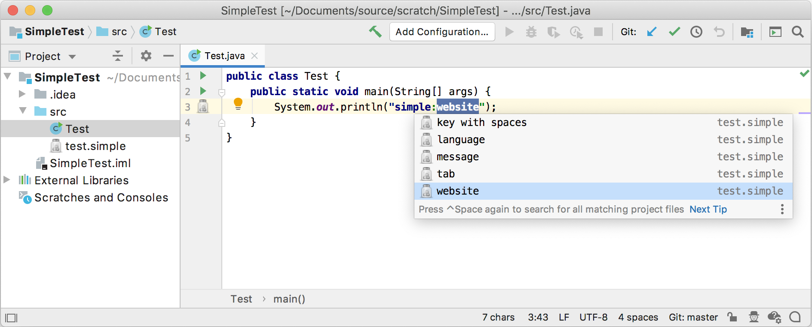
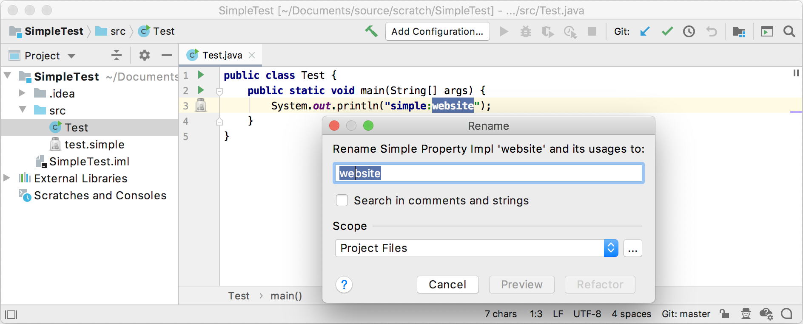
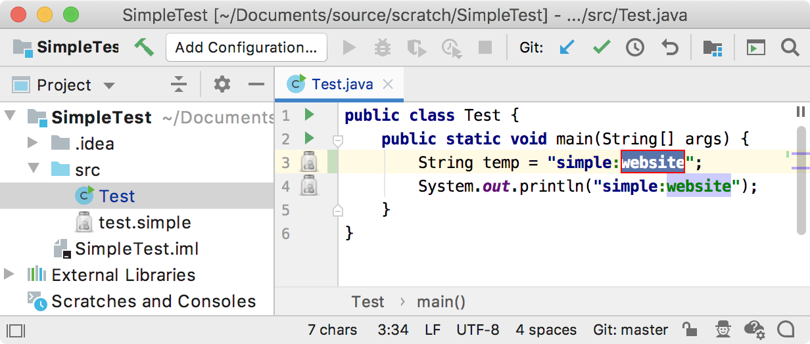

<!-- Copyright 2000-2025 JetBrains s.r.o. and other contributors. Use of this source code is governed by the Apache 2.0 license that can be found in the LICENSE file. -->

The references functionality is one of the most important parts in the implementation of custom language support.
Resolving references means the ability to go from the usage of an element to its declaration, completion, rename refactoring, find usages, etc.

::: info
Every PSI element that can be renamed or referenced needs to implement `PsiNamedElement` interface.
:::


**Reference**: [References and Resolve](/reference_guide/custom_language_support/references_and_resolve.md)


## 10.1. Define a Named Element Class
The classes below show how the Simple Language fulfills the need to implement `PsiNamedElement`.

The `SimpleNamedElement` interface is subclassed from `PsiNameIdentifierOwner`.

```java
package org.consulo.sdk.language.psi;

import consulo.language.psi.PsiNameIdentifierOwner;

public interface SimpleNamedElement extends PsiNameIdentifierOwner {

}
```

The `SimpleNamedElementImpl` class implements the `SimpleNamedElement` interface and extends `ASTWrapperPsiElement`.

```java
package org.consulo.sdk.language.psi.impl;

import consulo.language.ast.ASTNode;
import consulo.language.impl.psi.ASTWrapperPsiElement;
import org.consulo.sdk.language.psi.SimpleNamedElement;

import jakarta.annotation.Nonnull;

public abstract class SimpleNamedElementImpl extends ASTWrapperPsiElement implements SimpleNamedElement {

  public SimpleNamedElementImpl(@Nonnull ASTNode node) {
    super(node);
  }

}
```

## 10.2. Define Helper Methods for Generated PSI Elements
Modify `SimplePsiImplUtil` to support new methods that get added to the PSI class for Simple Language.
Note that `SimpleElementFactory` isn't defined until the [next step](#define-an-element-factory), so for now it shows as an error.

```java
public class SimplePsiImplUtil {

  // ...

  public static String getName(SimpleProperty element) {
      return getKey(element);
  }

  public static PsiElement setName(SimpleProperty element, String newName) {
      ASTNode keyNode = element.getNode().findChildByType(SimpleTypes.KEY);
      if (keyNode != null) {

          SimpleProperty property = SimpleElementFactory.createProperty(element.getProject(), newName);
          ASTNode newKeyNode = property.getFirstChild().getNode();
          element.getNode().replaceChild(keyNode, newKeyNode);
      }
      return element;
  }

  public static PsiElement getNameIdentifier(SimpleProperty element) {
      ASTNode keyNode = element.getNode().findChildByType(SimpleTypes.KEY);
      if (keyNode != null) {
          return keyNode.getPsi();
      } else {
          return null;
      }
  }

  // ...
}
```

## 10.3. Define an Element Factory
The `SimpleElementFactory` provides methods for creating `SimpleFile`.

```java
package org.consulo.sdk.language.psi;

import consulo.project.Project;
import consulo.language.psi.*;
import org.consulo.sdk.language.SimpleFileType;

public class SimpleElementFactory {
  public static SimpleProperty createProperty(Project project, String name) {
    final SimpleFile file = createFile(project, name);
    return (SimpleProperty) file.getFirstChild();
  }

  public static SimpleFile createFile(Project project, String text) {
    String name = "dummy.simple";
    return (SimpleFile) PsiFileFactory.getInstance(project).
                createFileFromText(name, SimpleFileType.INSTANCE, text);
  }
}
```

## 10.4. Update Grammar and Regenerate the Parser
Now make corresponding changes to the `Simple.bnf` grammar file by replacing the `property` definition with the lines below.
Don't forget to regenerate the parser after updating the file!
Right-click on the `Simple.bnf` file and select **Generate Parser Code**.

```java
property ::= (KEY? SEPARATOR VALUE?) | KEY {
  mixin="org.consulo.sdk.language.psi.impl.SimpleNamedElementImpl"
  implements="org.consulo.sdk.language.psi.SimpleNamedElement"
  methods=[getKey getValue getName setName getNameIdentifier]
}
```

## 10.5. Define a Reference
Now define a reference class to resolve a property from its usage.
This requires extending `PsiReferenceBase` and implementing `PsiPolyVariantReference`.
The latter enables the reference to resolve to more than one element or to resolve result(s) for a superset of valid resolve cases.

```java
package org.consulo.sdk.language;

import consulo.document.util.TextRange;
import consulo.language.editor.completion.lookup.LookupElement;
import consulo.language.editor.completion.lookup.LookupElementBuilder;
import consulo.language.psi.PsiElement;
import consulo.language.psi.PsiElementResolveResult;
import consulo.language.psi.PsiPolyVariantReferenceBase;
import consulo.language.psi.ResolveResult;
import consulo.project.Project;
import org.consulo.sdk.language.psi.SimpleProperty;

import jakarta.annotation.Nonnull;

import java.util.ArrayList;
import java.util.List;

final class SimpleReference extends PsiPolyVariantReferenceBase<PsiElement> {

  private final String key;

  SimpleReference(@Nonnull PsiElement element, TextRange textRange) {
    super(element, textRange);
    key = element.getText()
        .substring(textRange.getStartOffset(), textRange.getEndOffset());
  }

  @Nonnull
  @Override
  public ResolveResult[] multiResolve(boolean incompleteCode) {
    Project project = myElement.getProject();
    List<SimpleProperty> properties = SimpleUtil.findProperties(project, key);
    List<ResolveResult> results = new ArrayList<>();
    for (SimpleProperty property : properties) {
      results.add(new PsiElementResolveResult(property));
    }
    return results.toArray(new ResolveResult[0]);
  }

  @Nonnull
  @Override
  public Object[] getVariants() {
    Project project = myElement.getProject();
    List<SimpleProperty> properties = SimpleUtil.findProperties(project);
    List<LookupElement> variants = new ArrayList<>();
    for (SimpleProperty property : properties) {
      if (property.getKey() != null && !property.getKey().isEmpty()) {
        variants.add(LookupElementBuilder
            .create(property).withIcon(SimpleIcons.FILE)
            .withTypeText(property.getContainingFile().getName())
        );
      }
    }
    return variants.toArray();
  }

}
```

## 10.6. Define a Reference Contributor
A reference contributor allows the `simple_language_plugin` to provide references to Simple Language from elements in other languages such as Java.
Create `SimpleReferenceContributor` by subclassing `PsiReferenceContributor`.
Contribute a reference to each usage of a property:

```java
package org.consulo.sdk.language;

import consulo.annotation.component.ExtensionImpl;
import consulo.document.util.TextRange;
import consulo.language.Language;
import consulo.language.pattern.PlatformPatterns;
import consulo.language.psi.*;
import consulo.language.util.ProcessingContext;

import jakarta.annotation.Nonnull;

import static org.consulo.sdk.language.SimpleAnnotator.SIMPLE_PREFIX_STR;
import static org.consulo.sdk.language.SimpleAnnotator.SIMPLE_SEPARATOR_STR;

@ExtensionImpl
final class SimpleReferenceContributor extends PsiReferenceContributor {

  @Override
  public void registerReferenceProviders(@Nonnull PsiReferenceRegistrar registrar) {
    registrar.registerReferenceProvider(PlatformPatterns.psiElement(PsiLiteralExpression.class),
        new PsiReferenceProvider() {
          @Nonnull
          @Override
          public PsiReference[] getReferencesByElement(@Nonnull PsiElement element,
                                                       @Nonnull ProcessingContext context) {
            PsiLiteralExpression literalExpression = (PsiLiteralExpression) element;
            String value = literalExpression.getValue() instanceof String ?
                (String) literalExpression.getValue() : null;
            if ((value != null && value.startsWith(SIMPLE_PREFIX_STR + SIMPLE_SEPARATOR_STR))) {
              TextRange property = new TextRange(SIMPLE_PREFIX_STR.length() + SIMPLE_SEPARATOR_STR.length() + 1,
                  value.length() + 1);
              return new PsiReference[]{new SimpleReference(element, property)};
            }
            return PsiReference.EMPTY_ARRAY;
          }
        });
  }

}
```

## 10.7. Register the Reference Contributor
The `PsiReferenceContributor` base class is annotated with `@ExtensionAPI`. To register the reference contributor with the Consulo, annotate the `SimpleReferenceContributor` implementation class with `@ExtensionImpl`.

## 10.8. Run the Project
Rebuild the project, and run `simple_language_plugin` in a Development Instance.
The IDE now resolves the property and provides completion suggestions:



The Rename refactoring functionality is now available from definition and usages.



## 10.9. Define a Refactoring Support Provider
Support for in-place refactoring is specified explicitly in a refactoring support provider.
Create `SimpleRefactoringSupportProvider` by subclassing [`RefactoringSupportProvider`](https://github.com/consulo/consulo/blob/master/modules/base/language-editor-refactoring-api/src/main/java/consulo/language/editor/refactoring/RefactoringSupportProvider.java)
As long as an element is a `SimpleProperty` it is allowed to be refactored:

```java
package org.consulo.sdk.language;

import consulo.annotation.component.ExtensionImpl;
import consulo.language.Language;
import consulo.language.editor.refactoring.RefactoringSupportProvider;
import consulo.language.psi.PsiElement;
import org.consulo.sdk.language.psi.SimpleProperty;

import jakarta.annotation.Nonnull;
import jakarta.annotation.Nullable;

@ExtensionImpl
final class SimpleRefactoringSupportProvider extends RefactoringSupportProvider {

  @Nonnull
  @Override
  public Language getLanguage() {
    return SimpleLanguage.INSTANCE;
  }

  @Override
  public boolean isMemberInplaceRenameAvailable(@Nonnull PsiElement elementToRename, @Nullable PsiElement context) {
    return (elementToRename instanceof SimpleProperty);
  }

}
```

## 10.10. Register the Refactoring Support Provider
The [`RefactoringSupportProvider`](https://github.com/consulo/consulo/blob/master/modules/base/language-editor-refactoring-api/src/main/java/consulo/language/editor/refactoring/RefactoringSupportProvider.java) base class is annotated with `@ExtensionAPI`. To register the refactoring support provider with the Consulo, annotate the `SimpleRefactoringSupportProvider` implementation class with `@ExtensionImpl`.

## 10.11. Run the Project
Rebuild the project, and run `simple_language_plugin` in a Development Instance.
The IDE now supports refactoring suggestions:


