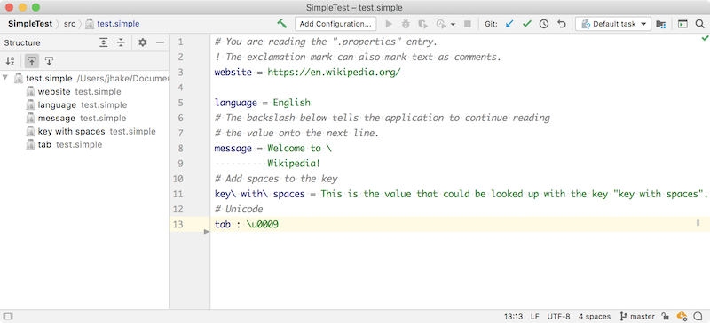

<!-- Copyright 2000-2025 JetBrains s.r.o. and other contributors. Use of this source code is governed by the Apache 2.0 license that can be found in the LICENSE file. -->

The structure view can be customized for a specific file type.
Creating a structure view factory allows showing the structure of any file in a _Structure_ Tool Window for easy navigation between items in the current editor.

**Reference**: [Structure View](/reference_guide/custom_language_support/structure_view.md)

* bullet list
{:toc}

## 14.1. Define a Structure View Factory
The structure view factory implements `PsiStructureViewFactory`.
The `getStructureViewBuilder()` implementation reuses the Consulo class [`TreeBasedStructureViewBuilder`](https://github.com/consulo/consulo/blob/master/modules/base/file-editor-api/src/main/java/consulo/fileEditor/structureView/TreeBasedStructureViewBuilder.java).
At this point the project will not compile until `SimpleStructureViewModel` is [implemented below](#define-a-structure-view-model).

```java
package org.consulo.sdk.language;

import consulo.annotation.component.ExtensionImpl;
import consulo.codeEditor.Editor;
import consulo.fileEditor.structureView.StructureViewBuilder;
import consulo.fileEditor.structureView.StructureViewModel;
import consulo.fileEditor.structureView.TreeBasedStructureViewBuilder;
import consulo.language.Language;
import consulo.language.editor.structureView.PsiStructureViewFactory;
import consulo.language.psi.PsiFile;

import jakarta.annotation.Nonnull;
import jakarta.annotation.Nullable;

@ExtensionImpl
final class SimpleStructureViewFactory implements PsiStructureViewFactory {

  @Nonnull
  @Override
  public Language getLanguage() {
    return SimpleLanguage.INSTANCE;
  }

  @Override
  public StructureViewBuilder getStructureViewBuilder(@Nonnull final PsiFile psiFile) {
    return new TreeBasedStructureViewBuilder() {
      @Nonnull
      @Override
      public StructureViewModel createStructureViewModel(@Nullable Editor editor) {
        return new SimpleStructureViewModel(editor, psiFile);
      }
    };
  }

}
```

## 14.2. Define a Structure View Model
The `SimpleStructureViewModel` is created by implementing `StructureViewModel`, which defines the model for data displayed in the standard structure view.
It also extends `StructureViewModelBase`, an implementation that links the model to a text editor.

```java
package org.consulo.sdk.language;

import consulo.codeEditor.Editor;
import consulo.fileEditor.structureView.StructureViewModel;
import consulo.fileEditor.structureView.StructureViewModelBase;
import consulo.fileEditor.structureView.StructureViewTreeElement;
import consulo.fileEditor.structureView.tree.Sorter;
import consulo.language.psi.PsiFile;
import org.consulo.sdk.language.psi.SimpleProperty;

import jakarta.annotation.Nonnull;
import jakarta.annotation.Nullable;

public class SimpleStructureViewModel extends StructureViewModelBase implements
    StructureViewModel.ElementInfoProvider {

  public SimpleStructureViewModel(@Nullable Editor editor, PsiFile psiFile) {
    super(psiFile, editor, new SimpleStructureViewElement(psiFile));
  }

  @Nonnull
  public Sorter[] getSorters() {
    return new Sorter[]{Sorter.ALPHA_SORTER};
  }

  @Override
  public boolean isAlwaysShowsPlus(StructureViewTreeElement element) {
    return false;
  }

  @Override
  public boolean isAlwaysLeaf(StructureViewTreeElement element) {
    return element.getValue() instanceof SimpleProperty;
  }

  @Nonnull
  @Override
  protected Class<?>[] getSuitableClasses() {
    return new Class[]{SimpleProperty.class};
  }

}
```

## 14.3. Define a Structure View Element
The `SimpleStructureViewElement` implements `StructureViewTreeElement` and `SortableTreeElement`.
The `StructureViewTreeElement` represents an element in the Structure View tree model.
The `SortableTreeElement` represents an item in a smart tree that allows using text other than the presentable text as a key for alphabetic sorting.

```java
package org.consulo.sdk.language;

import consulo.fileEditor.structureView.StructureViewTreeElement;
import consulo.fileEditor.structureView.tree.SortableTreeElement;
import consulo.fileEditor.structureView.tree.TreeElement;
import consulo.language.psi.NavigatablePsiElement;
import consulo.language.psi.util.PsiTreeUtil;
import consulo.navigation.ItemPresentation;
import consulo.ui.ex.tree.PresentationData;
import org.consulo.sdk.language.psi.SimpleFile;
import org.consulo.sdk.language.psi.SimpleProperty;
import org.consulo.sdk.language.psi.impl.SimplePropertyImpl;

import jakarta.annotation.Nonnull;

import java.util.ArrayList;
import java.util.List;

public class SimpleStructureViewElement implements StructureViewTreeElement, SortableTreeElement {

  private final NavigatablePsiElement myElement;

  public SimpleStructureViewElement(NavigatablePsiElement element) {
    this.myElement = element;
  }

  @Override
  public Object getValue() {
    return myElement;
  }

  @Override
  public void navigate(boolean requestFocus) {
    myElement.navigate(requestFocus);
  }

  @Override
  public boolean canNavigate() {
    return myElement.canNavigate();
  }

  @Override
  public boolean canNavigateToSource() {
    return myElement.canNavigateToSource();
  }

  @Nonnull
  @Override
  public String getAlphaSortKey() {
    String name = myElement.getName();
    return name != null ? name : "";
  }

  @Nonnull
  @Override
  public ItemPresentation getPresentation() {
    ItemPresentation presentation = myElement.getPresentation();
    return presentation != null ? presentation : new PresentationData();
  }

  @Nonnull
  @Override
  public TreeElement[] getChildren() {
    if (myElement instanceof SimpleFile) {
      List<SimpleProperty> properties = PsiTreeUtil.getChildrenOfTypeAsList(myElement, SimpleProperty.class);
      List<TreeElement> treeElements = new ArrayList<>(properties.size());
      for (SimpleProperty property : properties) {
        treeElements.add(new SimpleStructureViewElement((SimplePropertyImpl) property));
      }
      return treeElements.toArray(new TreeElement[0]);
    }
    return EMPTY_ARRAY;
  }

}
```

## 14.4. Register the Structure View Factory
The `SimpleStructureViewFactory` implementation is registered with the Consulo by annotating the class with `@ExtensionImpl`. The base interface `PsiStructureViewFactory` is annotated with `@ExtensionAPI`, so the Consulo discovers the implementation automatically.

## 14.5. Run the Project
Rebuild the project, and run `simple_language_plugin` in a Development Instance.
Open the `test.simple` file and choose **View \| Tool Windows \| Structure**.
The IDE now supports a structure view of the Simple Language:


