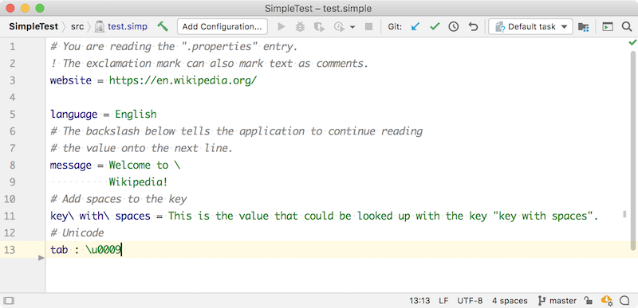
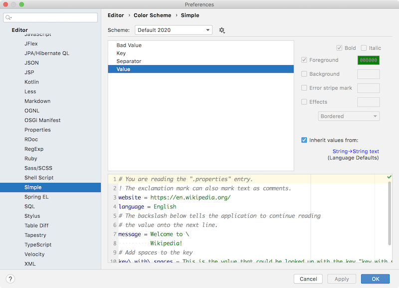

<!-- Copyright 2000-2025 JetBrains s.r.o. and other contributors. Use of this source code is governed by the Apache 2.0 license that can be found in the LICENSE file. -->

The first level of syntax highlighting is based on the lexer output, and is provided by `SyntaxHighlighter`.
A plugin can also define color settings based on `ColorSettingPage` so the user can configure highlight colors.
The `SimpleSyntaxHighlighter`, `SimpleSyntaxHighlighterFactory`, and `SimpleColorSettingsPage` discussed on this page are demonstrated in the `simple_language_plugin` code sample.

**Reference**: [Syntax Highlighting and Error Highlighting](/reference_guide/custom_language_support/syntax_highlighting_and_error_highlighting.md)


## 5.1. Define a Syntax Highlighter
The Simple Language syntax highlighter class extends `SyntaxHighlighterBase`.
As recommended in [Color Scheme Management](/reference_guide/color_scheme_management.md#text-attribute-key-dependency), the Simple Language highlighting text attributes are specified as a dependency on one of standard Consulo keys.
For the Simple Language, define only one scheme.

```java
package org.consulo.sdk.language;

import consulo.colorScheme.DefaultLanguageHighlighterColors;
import consulo.colorScheme.HighlighterColors;
import consulo.colorScheme.TextAttributesKey;
import consulo.language.ast.IElementType;
import consulo.language.ast.TokenType;
import consulo.language.editor.highlight.SyntaxHighlighterBase;
import consulo.language.lexer.Lexer;
import org.consulo.sdk.language.psi.SimpleTypes;

import jakarta.annotation.Nonnull;

import static consulo.colorScheme.TextAttributesKey.createTextAttributesKey;

public class SimpleSyntaxHighlighter extends SyntaxHighlighterBase {

  public static final TextAttributesKey SEPARATOR =
      createTextAttributesKey("SIMPLE_SEPARATOR", DefaultLanguageHighlighterColors.OPERATION_SIGN);
  public static final TextAttributesKey KEY =
      createTextAttributesKey("SIMPLE_KEY", DefaultLanguageHighlighterColors.KEYWORD);
  public static final TextAttributesKey VALUE =
      createTextAttributesKey("SIMPLE_VALUE", DefaultLanguageHighlighterColors.STRING);
  public static final TextAttributesKey COMMENT =
      createTextAttributesKey("SIMPLE_COMMENT", DefaultLanguageHighlighterColors.LINE_COMMENT);
  public static final TextAttributesKey BAD_CHARACTER =
      createTextAttributesKey("SIMPLE_BAD_CHARACTER", HighlighterColors.BAD_CHARACTER);

  private static final TextAttributesKey[] BAD_CHAR_KEYS = new TextAttributesKey[]{BAD_CHARACTER};
  private static final TextAttributesKey[] SEPARATOR_KEYS = new TextAttributesKey[]{SEPARATOR};
  private static final TextAttributesKey[] KEY_KEYS = new TextAttributesKey[]{KEY};
  private static final TextAttributesKey[] VALUE_KEYS = new TextAttributesKey[]{VALUE};
  private static final TextAttributesKey[] COMMENT_KEYS = new TextAttributesKey[]{COMMENT};
  private static final TextAttributesKey[] EMPTY_KEYS = new TextAttributesKey[0];

  @Nonnull
  @Override
  public Lexer getHighlightingLexer() {
    return new SimpleLexerAdapter();
  }

  @Nonnull
  @Override
  public TextAttributesKey[] getTokenHighlights(IElementType tokenType) {
    if (tokenType.equals(SimpleTypes.SEPARATOR)) {
      return SEPARATOR_KEYS;
    }
    if (tokenType.equals(SimpleTypes.KEY)) {
      return KEY_KEYS;
    }
    if (tokenType.equals(SimpleTypes.VALUE)) {
      return VALUE_KEYS;
    }
    if (tokenType.equals(SimpleTypes.COMMENT)) {
      return COMMENT_KEYS;
    }
    if (tokenType.equals(TokenType.BAD_CHARACTER)) {
      return BAD_CHAR_KEYS;
    }
    return EMPTY_KEYS;
  }

}
```

### 5.2. Define a Syntax Highlighter Factory
The factory provides a standard way for the Consulo to instantiate the syntax highlighter for Simple Language files.
Here, `SimpleSyntaxHighlighterFactory` subclasses [`SyntaxHighlighterFactory`](https://github.com/consulo/consulo/blob/master/modules/base/language-editor-api/src/main/java/consulo/language/editor/highlight/SyntaxHighlighterFactory.java).

```java
package org.consulo.sdk.language;

import consulo.annotation.component.ExtensionImpl;
import consulo.language.Language;
import consulo.language.editor.highlight.SyntaxHighlighter;
import consulo.language.editor.highlight.SyntaxHighlighterFactory;
import consulo.project.Project;
import consulo.virtualFileSystem.VirtualFile;

import jakarta.annotation.Nonnull;
import jakarta.annotation.Nullable;

@ExtensionImpl
final class SimpleSyntaxHighlighterFactory extends SyntaxHighlighterFactory {

  @Nonnull
  @Override
  public Language getLanguage() {
    return SimpleLanguage.INSTANCE;
  }

  @Nonnull
  @Override
  public SyntaxHighlighter getSyntaxHighlighter(@Nullable Project project, @Nullable VirtualFile virtualFile) {
    return new SimpleSyntaxHighlighter();
  }

}
```

### 5.3. Register the Syntax Highlighter Factory
The [`SyntaxHighlighterFactory`](https://github.com/consulo/consulo/blob/master/modules/base/language-editor-api/src/main/java/consulo/language/editor/highlight/SyntaxHighlighterFactory.java) base class is annotated with `@ExtensionAPI(ComponentScope.APPLICATION)`. To register the factory with the Consulo, annotate the `SimpleSyntaxHighlighterFactory` implementation class with `@ExtensionImpl`.

### 5.4. Run the Project
Open the example Simple Language [properties file ](/tutorials/custom_language_support/lexer_and_parser_definition.md#run-the-project) (`test.simple`) in the IDE Development Instance.
The colors for Simple Language Key, Separator, and Value highlighting default to the IDE _Language Defaults_ for Keyword, Braces, Operators, and Strings, respectively.



## 5.5. Define a Color Settings Page
The color settings page adds the ability for users to customize color settings for the highlighting in Simple Language files.
The `SimpleColorSettingsPage` implements `ColorSettingsPage`.

```java
package org.consulo.sdk.language;

import consulo.annotation.component.ExtensionImpl;
import consulo.colorScheme.TextAttributesKey;
import consulo.colorScheme.setting.AttributesDescriptor;
import consulo.colorScheme.setting.ColorDescriptor;
import consulo.language.editor.colorScheme.setting.ColorSettingsPage;
import consulo.language.editor.highlight.SyntaxHighlighter;
import consulo.ui.image.Image;

import jakarta.annotation.Nonnull;
import jakarta.annotation.Nullable;

import java.util.Map;

@ExtensionImpl
final class SimpleColorSettingsPage implements ColorSettingsPage {

  private static final AttributesDescriptor[] DESCRIPTORS = new AttributesDescriptor[]{
      new AttributesDescriptor("Key", SimpleSyntaxHighlighter.KEY),
      new AttributesDescriptor("Separator", SimpleSyntaxHighlighter.SEPARATOR),
      new AttributesDescriptor("Value", SimpleSyntaxHighlighter.VALUE),
      new AttributesDescriptor("Bad value", SimpleSyntaxHighlighter.BAD_CHARACTER)
  };

  @Override
  public Image getIcon() {
    return SimpleIcons.FILE;
  }

  @Nonnull
  @Override
  public SyntaxHighlighter getHighlighter() {
    return new SimpleSyntaxHighlighter();
  }

  @Nonnull
  @Override
  public String getDemoText() {
    return "# You are reading the \".properties\" entry.\n" +
        "! The exclamation mark can also mark text as comments.\n" +
        "website = https://en.wikipedia.org/\n" +
        "language = English\n" +
        "# The backslash below tells the application to continue reading\n" +
        "# the value onto the next line.\n" +
        "message = Welcome to \\\n" +
        "          Wikipedia!\n" +
        "# Add spaces to the key\n" +
        "key\\ with\\ spaces = This is the value that could be looked up with the key \"key with spaces\".\n" +
        "# Unicode\n" +
        "tab : \\u0009";
  }

  @Nullable
  @Override
  public Map<String, TextAttributesKey> getAdditionalHighlightingTagToDescriptorMap() {
    return null;
  }

  @Nonnull
  @Override
  public AttributesDescriptor[] getAttributeDescriptors() {
    return DESCRIPTORS;
  }

  @Nonnull
  @Override
  public ColorDescriptor[] getColorDescriptors() {
    return ColorDescriptor.EMPTY_ARRAY;
  }

  @Nonnull
  @Override
  public String getDisplayName() {
    return "Simple";
  }

}
```

### 5.6. Register the Color Settings Page
The `ColorSettingsPage` interface is annotated with `@ExtensionAPI`. To register the Simple Language color settings page with the Consulo, annotate the `SimpleColorSettingsPage` implementation class with `@ExtensionImpl`.

### 5.7. Run the Project
In the IDE Development Instance, open the Simple Language highlight settings page: **Preferences/Settings \| Editor \| Color Scheme \| Simple**.
Each color initially inherits from a _Language Defaults_ value.


