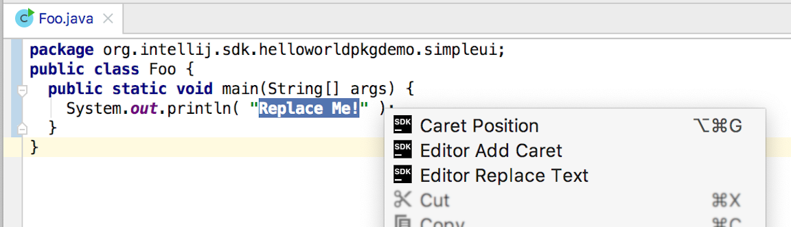

<!-- Copyright 2000-2020 JetBrains s.r.o. and other contributors. Use of this source code is governed by the Apache 2.0 license that can be found in the LICENSE file. -->

This tutorial shows how to use actions to access a caret placed in a document open in an editor.
Using information about the caret, replace selected text in a document with a string.
The tutorial presents the following sections:

* bullet list
{:toc}

## Introduction
The approach in this tutorial relies heavily on creating and registering actions.
To review the fundamentals of creating and registering actions, refer to the [Actions Tutorial](/tutorials/action_system.md).

Multiple examples are used from the editor_basics plugin code sample from the Consulo SDK.
It may be helpful to open that project in a Consulo-based IDE, build the project, run it, select some text in the editor, and invoke the **Editor Replace Text** menu item on the editor context menu.

{:width="600px"}

## Creating a New Menu Action
In this example, we access the [`Editor`](https://github.com/consulo/consulo/blob/master/modules/base/code-editor-api/src/main/java/consulo/codeEditor/Editor.java) from an action.
The source code for the Java class in this example is `EditorIllustrationAction`.

To register the action, annotate the action class with `@ActionImpl`.
For more information, refer to the [Registering Actions](/tutorials/action_system/working_with_custom_actions.md#registering-a-custom-action) section of the Actions Tutorial.
The `EditorIllustrationAction` action is registered in the group `EditorPopupMenu` so it will be available from the context menu when focus is on the editor:

```java
@ActionImpl(id = "EditorBasics.EditorIllustrationAction", parents = @ActionParentRef(@ActionRef(id = "EditorPopupMenu")))
public class EditorIllustrationAction extends AnAction {
    // ...
}
```

## Defining the Menu Action's Visibility
To determine conditions by which the action will be visible and available requires `EditorIllustrationAction` to override the [`AnAction.update()`](https://github.com/consulo/consulo/blob/master/modules/base/ui-ex-api/src/main/java/consulo/ui/ex/action/AnAction.java) method.
For more information, refer to [Extending the Update Method](/tutorials/action_system/working_with_custom_actions.md#extending-the-update-method) section of the Actions Tutorial.

To work with a selected part of the text, it's reasonable to make the menu action available only when the following requirements are met:
* There is a [`Project`](https://github.com/consulo/consulo/blob/master/modules/base/project-api/src/main/java/consulo/project/Project.java) object,
* There is an instance of [`Editor`](https://github.com/consulo/consulo/blob/master/modules/base/code-editor-api/src/main/java/consulo/codeEditor/Editor.java) available,
* There is a text selection in [`Editor`](https://github.com/consulo/consulo/blob/master/modules/base/code-editor-api/src/main/java/consulo/codeEditor/Editor.java).

Additional steps will show how to check these conditions through obtaining instances of [`Project`](https://github.com/consulo/consulo/blob/master/modules/base/project-api/src/main/java/consulo/project/Project.java) and [`Editor`](https://github.com/consulo/consulo/blob/master/modules/base/code-editor-api/src/main/java/consulo/codeEditor/Editor.java) objects, and how to show or hide the action's menu items based on them.

### Getting an Instance of the Active Editor from an Action Event
Using the [`AnActionEvent`](https://github.com/consulo/consulo/blob/master/modules/base/ui-ex-api/src/main/java/consulo/ui/ex/action/AnActionEvent.java) event passed into the `update` method, a reference to an instance of the [`Editor`](https://github.com/consulo/consulo/blob/master/modules/base/code-editor-api/src/main/java/consulo/codeEditor/Editor.java) can be obtained by calling `getData(CommonDataKeys.EDITOR)`.
Similarly, to obtain a project reference, we use the `getProject()` method.

```java
public class EditorIllustrationAction extends AnAction {
    @Override
    public void update(@NotNull final AnActionEvent e) {
      // Get required data keys
      final Project project = e.getProject();
      final Editor editor = e.getData(CommonDataKeys.EDITOR);
    }
}
```

**Note:**
There are other ways to access an [`Editor`](https://github.com/consulo/consulo/blob/master/modules/base/code-editor-api/src/main/java/consulo/codeEditor/Editor.java) instance:
* If a `DataContext` object is available: `CommonDataKeys.EDITOR.getData(context);`
* If only a [`Project`](https://github.com/consulo/consulo/blob/master/modules/base/project-api/src/main/java/consulo/project/Project.java) object is available, use [`FileEditorManager.getInstance(project).getSelectedTextEditor()`](https://github.com/consulo/consulo/blob/master/modules/base/file-editor-api/src/main/java/consulo/fileEditor/FileEditorManager.java)

### Obtaining a Caret Model and Selection
After making sure a project is open, and an instance of the [`Editor`](https://github.com/consulo/consulo/blob/master/modules/base/code-editor-api/src/main/java/consulo/codeEditor/Editor.java) is obtained, we need to check if any selection is available.
The [`SelectionModel`](https://github.com/consulo/consulo/blob/master/modules/base/code-editor-api/src/main/java/consulo/codeEditor/SelectionModel.java) interface is accessed from the [`Editor`](https://github.com/consulo/consulo/blob/master/modules/base/code-editor-api/src/main/java/consulo/codeEditor/Editor.java) object.
Determining whether some text is selected is accomplished by calling the [`SelectionModel.hasSelection()`](https://github.com/consulo/consulo/blob/master/modules/base/code-editor-api/src/main/java/consulo/codeEditor/SelectionModel.java) method.
Here's how the `EditorIllustrationAction.update(AnActionEvent e)` method should look:

```java
public class EditorIllustrationAction extends AnAction {
  @Override
  public void update(@NotNull final AnActionEvent e) {
    // Get required data keys
    final Project project = e.getProject();
    final Editor editor = e.getData(CommonDataKeys.EDITOR);

    // Set visibility only in case of existing project and editor and if a selection exists
    e.getPresentation().setEnabledAndVisible( project != null
                                              && editor != null
                                              && editor.getSelectionModel().hasSelection() );
  }
}
```

**Note:**
[`Editor`](https://github.com/consulo/consulo/blob/master/modules/base/code-editor-api/src/main/java/consulo/codeEditor/Editor.java) also allows access to different models of text representation.
The model classes include:
* [`CaretModel`](https://github.com/consulo/consulo/blob/master/modules/base/code-editor-api/src/main/java/consulo/codeEditor/CaretModel.java),
* `FoldingModel`,
* `IndentsModel`,
* `ScrollingModel`,
* `SoftWrapModel`


## Safely Replacing Selected Text in the Document
Based on the evaluation of conditions by `EditorIllustrationAction.update()`, the `EditorIllustrationAction` action menu item is visible.
To make the menu item do something, the `EditorIllustrationAction` class must override the [`AnAction.actionPerformed()`](https://github.com/consulo/consulo/blob/master/modules/base/ui-ex-api/src/main/java/consulo/ui/ex/action/AnAction.java) method.
As explained below, this will require the `EditorIllustrationAction.actionPerformed()` method to:
* Gain access to the document.
* Get the character locations defining the selection.
* Safely replace the contents of the selection.

Modifying the selected text requires an instance of the [`Document`](https://github.com/consulo/consulo/blob/master/modules/base/document-api/src/main/java/consulo/document/Document.java) object, which is accessed from the [`Editor`](https://github.com/consulo/consulo/blob/master/modules/base/code-editor-api/src/main/java/consulo/codeEditor/Editor.java) object.
The [Document](/basics/architectural_overview/documents.md) represents the contents of a text file loaded into memory and opened in an Consulo-based IDE editor.
An instance of the `Document` will be used later when a text replacement is performed.

The text replacement will also require information about where the selection is in the document, which is provided by the primary `Caret` object, obtained from the `CaretModel`.
Selection information is measured in terms of [Offset](coordinates_system.md#caret-offset), the count of characters from the beginning of the document to a caret location.

Text replacement could be done by calling the `Document` object's `replaceString()` method.
However, safely replacing the text requires the `Document` to be locked and any changes performed in a write action.
See the [Threading Issues](/basics/architectural_overview/general_threading_rules.md) section to learn more about synchronization issues and changes safety on the Consulo.
This example changes the document within a `WriteCommandAction`.

The complete `EditorIllustrationAction.actionPerformed()` method is shown below:
* Note the selection in the document is replaced by a string using a method on the `Document` object, but the method call is wrapped in a write action.
* After the document change, the new text is de-selected by a call to the primary caret.

```java
public class EditorIllustrationAction extends AnAction {
  @Override
  public void actionPerformed(@NotNull final AnActionEvent e) {
    // Get all the required data from data keys
    final Editor editor = e.getRequiredData(CommonDataKeys.EDITOR);
    final Project project = e.getRequiredData(CommonDataKeys.PROJECT);
    final Document document = editor.getDocument();

    // Work off of the primary caret to get the selection info
    Caret primaryCaret = editor.getCaretModel().getPrimaryCaret();
    int start = primaryCaret.getSelectionStart();
    int end = primaryCaret.getSelectionEnd();

    // Replace the selection with a fixed string.
    // Must do this document change in a write action context.
    WriteCommandAction.runWriteCommandAction(project, () ->
        document.replaceString(start, end, "editor_basics")
    );

    // De-select the text range that was just replaced
    primaryCaret.removeSelection();
  }
}
```
