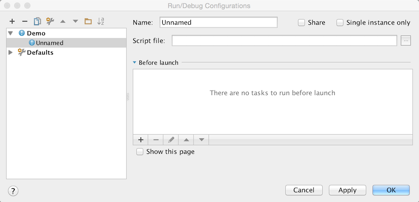
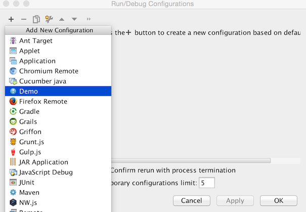

<!-- Copyright 2000-2025 JetBrains s.r.o. and other contributors. Use of this source code is governed by the Apache 2.0 license that can be found in the LICENSE file. -->

These series of steps show how to register and implement a simple Run Configuration.
Run Configurations are used to run internal and external processes from within *Consulo* based products.
To get familiar with the concept of a Run Configuration refer to the Run/Debug Configuration section of the Consulo documentation.

## Pre-Requirements

Create an empty plugin project as described in [Creating a Plugin Project](/basics/getting_started.md).

## 1. Implement ConfigurationType

Implement the `ConfigurationType` interface.
In Consulo, `ConfigurationType` is annotated with `@ExtensionAPI(ComponentScope.APPLICATION)`, so implementations are registered using the `@ExtensionImpl` annotation instead of XML.

```java
@ExtensionImpl
public class DemoRunConfigurationType implements ConfigurationType {
    @Override
    public String getDisplayName() {
        return "Demo";
    }

    @Override
    public String getConfigurationTypeDescription() {
        return "Demo Run Configuration Type";
    }

    @Override
    public Icon getIcon() {
        return AllIcons.General.Information;
    }

    @NotNull
    @Override
    public String getId() {
        return "DemoRunConfiguration";
    }

    @Override
    public ConfigurationFactory[] getConfigurationFactories() {
        return new ConfigurationFactory[]{new DemoConfigurationFactory(this)};
    }
}
```

## 2. Implement a ConfigurationFactory

Implement a new `ConfigurationFactory` through which custom run configurations will be created.

```java
public class DemoConfigurationFactory extends ConfigurationFactory {
    private static final String FACTORY_NAME = "Demo configuration factory";

    protected DemoConfigurationFactory(ConfigurationType type) {
        super(type);
    }

    @Override
    public RunConfiguration createTemplateConfiguration(Project project) {
        return new DemoRunConfiguration(project, this, "Demo");
    }

    @Override
    public String getName() {
        return FACTORY_NAME;
    }
}

```

## 3. Implement a Run Configuration

To make your changes visible from the UI, implement a new Run Configuration.

**Note:** In most of the cases you can derive a custom Run Configuration class from the `RunConfigurationBase`.
If you need to implement specific settings externalization rules and I/O behaviour, use `RunConfiguration` interface.

```java
public class DemoRunConfiguration extends RunConfigurationBase {
    protected DemoRunConfiguration(Project project, ConfigurationFactory factory, String name) {
        super(project, factory, name);
    }

    @NotNull
    @Override
    public SettingsEditor<? extends RunConfiguration> getConfigurationEditor() {
        return new DemoSettingsEditor();
    }

    @Override
    public void checkConfiguration() throws RuntimeConfigurationException {

    }

    @Nullable
    @Override
    public RunProfileState getState(@NotNull Executor executor, @NotNull ExecutionEnvironment executionEnvironment) throws ExecutionException {
        return null;
    }
}
```

## 4. Create and Implement Run Configuration UI Form

Make sure _UI Designer_ plugin is enabled.

Create a new UI form that defines, how an inner part of the new Run Configuration should look like.

Default Run Configuration will be looking like this:



## 5. Bind the UI Form

The UI Form should be bound with a Java class responsible for handling UI components logic.

```java
public class DemoSettingsEditor extends SettingsEditor<DemoRunConfiguration> {
    private JPanel myPanel;
    private LabeledComponent<ComponentWithBrowseButton> myMainClass;

    @Override
    protected void resetEditorFrom(DemoRunConfiguration demoRunConfiguration) {

    }

    @Override
    protected void applyEditorTo(DemoRunConfiguration demoRunConfiguration) throws ConfigurationException {

    }

    @NotNull
    @Override
    protected JComponent createEditor() {
        return myPanel;
    }

    private void createUIComponents() {
        myMainClass = new LabeledComponent<ComponentWithBrowseButton>();
        myMainClass.setComponent(new TextFieldWithBrowseButton());
    }
}
```

## 6. Compile and Run the Plugin

Refer to [Running and Debugging a Plugin](/basics/getting_started/running_and_debugging_a_plugin.md).

After going through the steps described above you can create a custom Run Configuration from your plugin.


