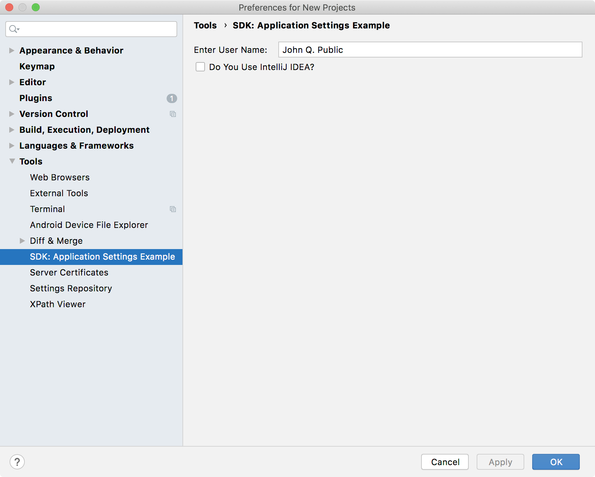
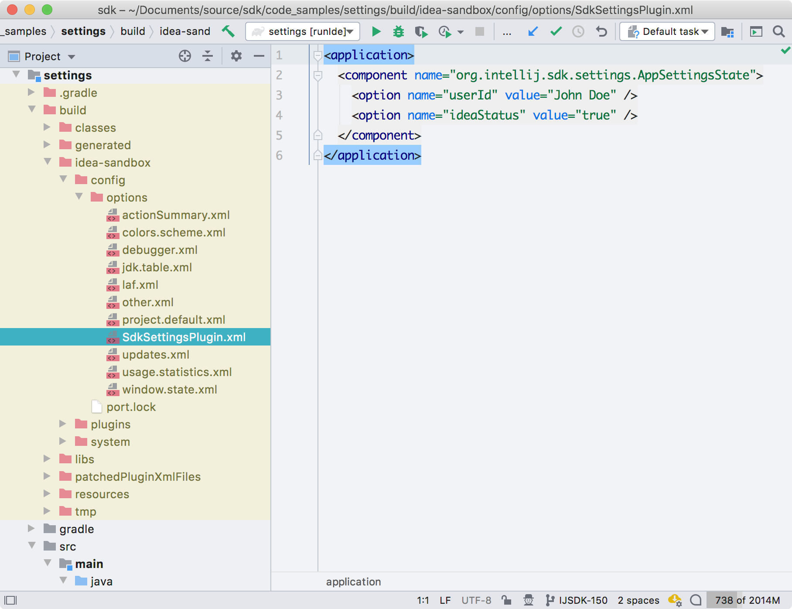

<!-- Copyright 2000-2020 JetBrains s.r.o. and other contributors. Use of this source code is governed by the Apache 2.0 license that can be found in the LICENSE file. -->

## Introduction
As discussed in the [_Settings_ Guide](/reference_guide/settings_guide.md), plugins can add Settings to Consulo-based IDEs.
The IDE displays the Settings in response to a user choosing **Settings/Preferences**.
Custom Settings are displayed and function just like those native to the IDE.

* bullet list
{:toc}

## Overview of a Custom Settings Implementation
Using the SDK code sample `settings`, this tutorial illustrates the steps to create custom Application-level Settings.
Many Consulo Settings implementations use fewer classes, but the `settings` code sample factors the functionality into three classes for clarity:
* The `AppSettingsConfigurable` is analogous to a Controller in the MVC model - it interacts with the other two Settings classes and the Consulo,
* The `AppSettingsState` is like a Model because it stores the Settings persistently,
* The `AppSettingsComponent` is similar to a View because it displays and captures edits to the values of the Settings.

The structure of the implementation is the same for Project Settings, but there are minor differences in the [`Configurable` implementation](/reference_guide/settings_guide.md#constructors) and [Extension Point (EP) declaration](/reference_guide/settings_guide.md#declaring-project-settings).

## The AppSettingsState Class
The `AppSettingsState` class persistently stores the custom Settings.
It is based on the [Consulo Persistence Model](/basics/persisting_state_of_components.md#using-persistentstatecomponent).

### Declaring AppSettingsState
Given a [Light Service](/basics/plugin_structure/plugin_services.md#light-services) is not used, the persistent data class must be declared as a [Service](/basics/plugin_structure/plugin_services.md#declaring-a-service) EP in the `plugin.xml` file.
If these were Project Settings, the `consulo.projectService` EP would be used.
However, because these are Application Settings, the `consulo.applicationService` EP is used with the FQN of the implementation class:

```xml
  <extensions defaultExtensionNs="consulo">
    <applicationService serviceImplementation="org.intellij.sdk.settings.AppSettingsState"/>
  </extensions>
```

### Creating the AppSettingState Implementation
As discussed in [Implementing the PersistentStateComponent Interface](/basics/persisting_state_of_components.md#implementing-the-persistentstatecomponent-interface), `AppSettingsState` uses the pattern of implementing `PersistentStateComponent` itself:

```java

```

#### Storage Annotation
The `@State` annotation, located just above the class declaration, [defines the data storage location](/basics/persisting_state_of_components.md#defining-the-storage-location).
For `AppSettingsState`, the data `name` parameter is the FQN of the class.
Using FQN is a best practice to follow, and is required if custom data gets stored in the standard project or workspace files.

The `storages` parameter utilizes the `@Storage` annotation to define a custom file name for the `AppSettingsState` data.
In this case, the file is located in the `options` directory of the configuration directory for the IDE.

#### Persistent Data Fields
The `AppSettingState` implementation has two public fields: a `String` and a `boolean`.
Conceptually these fields hold the name of a user, and whether that person is a Consulo user, respectively.
See [Implementing the State Class](/basics/persisting_state_of_components.md#implementing-the-state-class) for more information about how `PersistentStateComponent` serializes public fields.

#### AppSettingState Methods
The fields are so limited and straightforward for this class that encapsulation is not used for simplicity.
All that's needed for functionality is to override the two methods called by the Consulo when a new component state is loaded (`PersistentStateComponent.loadState()`), and when a state is saved (`PersistentStateComponent.getState()`).
See `PersistentStateComponent` for more information about these methods.

One static convenience method has been added - `AppSettingState.getInstance()` - which allows `AppSettingsConfigurable` to easily acquire a reference to `AppSettingState`.

## The AppSettingsComponent Class
The role of the `AppSettingsComponent` is to provide a `JPanel` for the custom Settings to the IDE Settings Dialog.
The `AppSettingsComponent` has-a `JPanel`, and is responsible for its lifetime.
The `AppSettingsComponent` is instantiated by `AppSettingsConfigurable`.

### Creating the AppSettingsComponent Implementation
The `AppSettingsComponent` defines a `JPanel` containing a `JBTextField` and a `JBCheckBox` to hold and display the data that maps to the [data fields](#persistent-data-fields) of `AppSettingsState`:

```java

```

#### AppSettingsComponent Methods
The constructor builds the `JPanel` using the convenient `FormBuilder`, and saves a reference to the `JPanel`.
The rest of the class are simple accessors and mutators to encapsulate the UI components used on the `JPanel`.


## The AppSettingsConfigurable Class
The methods of `AppSettingsConfigurable` are called by the Consulo, and `AppSettingsConfigurable` in turn interacts with `AppSettingsComponent` and `AppSettingState`.

### Declaring the AppSettingsConfigurable
As described in [Declaring Application Settings](/reference_guide/settings_guide.md#declaring-application-settings), the `consulo.applicationConfigurable` is used as the EP.
An explanation of this declaration can be found in [Declaring Application Settings](/reference_guide/settings_guide.md#declaring-application-settings):

```xml
  <extensions defaultExtensionNs="consulo">
    <applicationConfigurable parentId="tools" instance="org.intellij.sdk.settings.AppSettingsConfigurable"
                             id="org.intellij.sdk.settings.AppSettingsConfigurable"
                             displayName="SDK: Application Settings Example"/>
  </extensions>
```


### Creating the AppSettingsConfigurable Implementation
The `AppSettingsConfigurable` class implements `Configurable` interface.
The class has one field to hold a reference to the `AppSettingsComponent`.

```java

```

#### AppSettingsConfigurable Methods
All the methods in this class are overrides of the methods in the `Configurable` interface.
Readers are encouraged to review the Javadoc comments for the `Configurable` methods.
Also review notes about [Consulo Interactions](/reference_guide/settings_guide.md#consulo-platform-interactions-with-configurable) with `Configurable` methods.

## Testing the Custom Settings Plugin
After performing the steps described above, compile and run the plugin in a Development Instance to see the custom Settings available in the Settings Dialog.
Open the IDE Settings by selecting **Settings/Preferences \| Tools \| SDK: Application Settings Example**.
The settings are preloaded with the default values:

{:width="600px"}

Now edit the settings values to "John Doe" and click the checkbox.
Click on the **OK** button to close the Settings dialog and save the changes.
Exit the Development Instance.

Open the file `SdkSettingsPlugin.xml` to see the Settings persistently stored.
In this demonstration the file resides in `code_samples/settings/build/idea-sandbox/config/options/`, but see [IDE Development Instances](/basics/ide_development_instance.md) for the general Development Instance case.

{:width="600px"}
