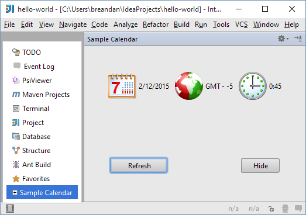

<!-- Copyright 2000-2020 JetBrains s.r.o. and other contributors. Use of this source code is governed by the Apache 2.0 license that can be found in the LICENSE file. -->

## Tool Windows

_Tool windows_ are child windows of the IDE used to display information.
These windows generally have their own toolbars (referred to as _tool window bars_) along the outer edges of the main window containing one or more _tool window buttons_, which activate panels displayed on the left, bottom and right sides of the main IDE window.
For detailed information about tool windows, please see _Consulo UI Guidelines_.

Each side contains two tool window groups, the primary and the secondary one, and only one tool window from each group can be active at a time.

Each tool window can show multiple tabs (or "contents", as they are called in the API).
For example, the Run tool window displays a tab for each active run configuration, and the Changes/Version Control tool window displays a fixed set of tabs depending on the version control system used in the project.

There are two main scenarios for the use of tool windows in a plugin.
Using declarative setup, a tool window button is always visible, and the user can activate it and interact with the plugin functionality at any time.
Alternatively, using programmatic setup, the tool window is created to show the results of a specific operation, and can be closed by the user after the operation is completed.

### Declarative Setup

The tool window is registered by implementing the [`consulo.project.ui.wm.ToolWindowFactory`](https://github.com/consulo/consulo/blob/master/modules/base/project-ui-api/src/main/java/consulo/project/ui/wm/ToolWindowFactory.java) interface and annotating the implementation class with `@ExtensionImpl`.
The `ToolWindowFactory` base interface is annotated with `@ExtensionAPI(ComponentScope.PROJECT)`.

Tool window properties such as the id, anchor, icon, and other display attributes are configured through the factory class methods.

When the user clicks on the tool window button, the `createToolWindowContent()` method of the factory class is called, and initializes the UI of the tool window.
This procedure ensures that unused tool windows don't cause any overhead in startup time or memory usage: if a user does not interact with the tool window, no plugin code will be loaded or executed.

```java
@ExtensionImpl
public class MyToolWindowFactory implements ToolWindowFactory {
    // Configure tool window properties via overridden methods
    // Implement createToolWindowContent() to initialize the UI
}
```

If the tool window of a plugin doesn't need to be displayed for all projects, implement the `isApplicable(Project)` method.

Note the condition is evaluated only once when the project is loaded; to show and hide a tool window dynamically while the user is working with the project use the second method for tool window registration.
              
To provide a localized text for the tool window button, specify matching `toolwindow.stripe.[id]` message key (escape spaces with `_`) in your [message bundle](/reference_guide/localization_guide.md) (code insight supported in 2020.3 and later).

### Programmatic Setup

The second method involves simply calling [`consulo.project.ui.wm.ToolWindowManager.registerToolWindow()`](https://github.com/consulo/consulo/blob/master/modules/base/project-ui-api/src/main/java/consulo/project/ui/wm/ToolWindowManager.java) from the plugin code.
The method has multiple overloads that can be used depending on the task.
When using an overload that takes a component, the component becomes the first content (tab) displayed in the tool window.
                     
## Contents (Tabs)

Displaying the contents of many tool windows requires access to the indices.
Because of that, tool windows are normally disabled while building indices unless the [`ToolWindowFactory`](https://github.com/consulo/consulo/blob/master/modules/base/project-ui-api/src/main/java/consulo/project/ui/wm/ToolWindowFactory.java) implements `DumbAware`. For programmatic setup, parameter `canWorkInDumbMode` must be set to `true` in calls to `registerToolWindow()`.

As mentioned previously, tool windows can contain multiple tabs, or contents.
To manage the contents of a tool window, call [`ToolWindow.getContentManager()`](https://github.com/consulo/consulo/blob/master/modules/base/ui-ex-api/src/main/java/consulo/ui/ex/toolWindow/ToolWindow.java).
To add a tab (content), first create it by calling [`ContentManager.getFactory().createContent()`](https://github.com/consulo/consulo/blob/master/modules/base/ui-ex-api/src/main/java/consulo/ui/ex/content/ContentManager.java), and then to add it to the tool window using [`ContentManager.addContent()`](https://github.com/consulo/consulo/blob/master/modules/base/ui-ex-api/src/main/java/consulo/ui/ex/content/ContentManager.java).

A plugin can control whether the user is allowed to close tabs either globally or on a per-tab basis.
The former is done by passing the `canCloseContents` parameter to the `registerToolWindow()` function.
The default value is `false`; calling `setClosable(true)` on [`ContentManager`](https://github.com/consulo/consulo/blob/master/modules/base/ui-ex-api/src/main/java/consulo/ui/ex/content/ContentManager.java) content will be ignored unless `canCloseContents` is explicitly set.
If closing tabs is enabled in general, a plugin can disable closing of specific tabs by calling [`Content.setCloseable(false)`](https://github.com/consulo/consulo/blob/master/modules/base/ui-ex-api/src/main/java/consulo/ui/ex/content/Content.java).

## Sample Plugin

To clarify how to develop plugins that create tool windows, consider the **toolWindow** sample plugin available in the SDK documentation.
This plugin creates the **Sample Calendar** tool window that displays the system date, time and time zone.

**To run the toolWindow plugin**

1. Start **Consulo** and open the **tool_window** project.
2. Ensure that the project settings are valid for the environment.
   If necessary, modify the project settings.
   To view or modify the project settings, open the **Project Structure** dialog.
3. Run the plugin by choosing the **Run | Run** on the main menu.

The plugin creates the **Sample Calendar** tool window.
When opened, this tool window is similar to the following screen:


